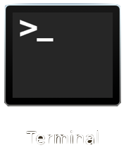
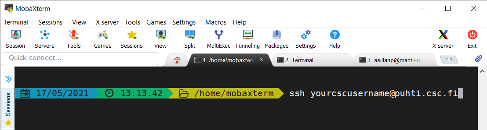

# Log in Puhti with ssh

> ‼️ To begin make sure that you have a [user account at CSC](https://docs.csc.fi/accounts/how-to-create-new-user-account/) and it is a member of a project that [has access to Puhti service](https://docs.csc.fi/accounts/how-to-add-service-access-for-project/).

💬 The basic Command Line Interface in Unix-based systems is the Terminal. Find the Terminal from your computer:  


💡 Different operating systems have a little bit different Command Line Interfaces and SSH-clients (programs that you can use for the connection with the supercomputers).

## Connecting from Linux

💬Laptops and workstations running Linux typically have SSH installed. 

1. Open a terminal and type:
```bash
ssh yourcscusername@puhti.csc.fi
```
2. Scroll down to [In Puhti](#in-puhti)

## Connecting from macOS

💬 In macOS, you can use Terminal similarly as with Linux machines. 
1. Open the Terminal application and type:
```bash
ssh yourcscusername@puhti.csc.fi
```
2. Scroll down to [In Puhti](#in-puhti)

## Windows10

💬 On Windows 10, you have different options:
- You can use the *Windows Power Shell*
- You can [download Putty](https://www.chiark.greenend.org.uk/~sgtatham/putty/latest.html)
- You can [download and install MobaXterm](https://mobaxterm.mobatek.net/download.html).

‼️ In this tutorial, we assume you use MobaXterm. [More examples can be found in docs](https://docs.csc.fi/computing/connecting/).

1. Launch MobaXterm from the applications list (opens from the windows logo) or search for it in the bottom bar search box.
2. Click "SSH" icon at top left corner.
3. In the Basic SSH settings section Remote host field write "puhti.csc.fi"
4. Tick the "specify username" box and in the box write your csc username (leave port in the default setting 22). 
5. Click "OK" at the bottom.
6. MobaXterm will now log you in puhti.csc.fi and ask you for your password.

💡 The next time you want to login to Puhti, just select it from the "session" menu on the left. 

💭 The MobXterm window looks like this:  


## In Puhti

1. If you're connecting to Puhti (or that Puhti login node) for the first time, SSH will ask you if you trust the authenticity of the host, e.g.:

```text
The authenticity of host 'puhti-login1.csc.fi (86.50.164.166)' can't be established.
ECDSA key fingerprint is SHA256:EXhadfadsfsaffasjhdlfjhasdlfkjhadsl.
Are you sure you want to continue connecting (yes/no/[fingerprint])?
```
2. the first time you connect, you need to accept, but the key should not change for the next login.
3. Pay attention whether you logged in `login1` or `login2`.
4. Once you've logged in you'll see a greeting starting something like this:

```
Last login: Mon Dec 14 14:53:15 2020 from jabadabaduu.fi
┌─ Welcome ───────────────────────────────────────────────────────────────────┐
│         CSC - Tieteen tietotekniikan keskus - IT Center for Science         │
│            ____        __    __  _                                          │
│           / __ \__  __/ /_  / /_(_)   - -  -   -                            │
│          / /_/ / / / / __ \/ __/ /   - -  -   -                             │
│         / ____/ /_/ / / / / /_/ /   - -  -   -                              │
│        /_/    \__,_/_/ /_/\__/_/   - -  -   -                               │
│                                                                             │
│      Puhti.csc.fi - Atos BullSequana X400 - 682 CPU nodes - 80 GPU nodes    │
├─ Contact ───────────────────────────────────────────────────────────────────┤
│ Servicedesk : 09-457 2821, servicedesk@csc.fi   Switchboard : 09-457 2001   │
├─ User Guide ────────────────────────────────────────────────────────────────┤
│ https://docs.csc.fi                                                         │
├─ Manage my account ─────────────────────────────────────────────────────────┤
│ https://my.csc.fi/                                                          │
...

└─────────────────────────────────────────────────────────────────────────────┘
[ yourcscusername@puhti-login1 ~]$
```
5. Now, you're ready to go. 

### Remote graphics
💬 By default the remote graphics may not work. Try the following if you want to use any graphical tools in Puhti.

#### In Linux/macOS
1. Add X11-tunneling to your ssh-connection, by adding `-X` or `-Y` to your command like this:
```bash
ssh -X yourcscusername@puhti.csc.fi
```

#### In Windows 
1. MobaXterm actually will tunnel the connection by default.

☝🏻 For intensive remote graphics we recommend using [NoMachine](https://docs.csc.fi/apps/nomachine/).
