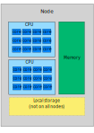
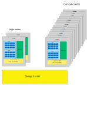

# Brief introduction to HPC environments {.title}

<small>
All materials (c) 2020-2024 by CSC – IT Center for Science Ltd.
This work is licensed under a **Creative Commons Attribution-ShareAlike** 4.0
Unported License, [http://creativecommons.org/licenses/by-sa/4.0/](http://creativecommons.org/licenses/by-sa/4.0/)
</small>

# Notes on vocabulary

- You can roughly think that one **node** is a single computer
- A node on a supercomputer contains:
  - One or more central processing units (**CPUs**) with many **cores**
  - Shared **memory**
- Some nodes may also have:
  - **Local storage**
  - Graphics processing units (**GPUs**)

{width=60%} 

# Cluster systems

- Login nodes are used to set up jobs (and to launch them)
- Jobs are run on the compute nodes
- A batch job system (scheduler) is used to run and manage the jobs
  - On CSC machines, we use Slurm
  - Other common systems include SGE and Torque/PBS
  - The syntax is different but basic operation is similar

{width=80%} 

# Available HPC resources

- [Puhti](https://docs.csc.fi/computing/systems-puhti/) is the general-purpose supercomputer ☑️
- [Mahti](https://docs.csc.fi/computing/systems-mahti/) is the massively parallel flagship supercomputer
- [LUMI](https://docs.lumi-supercomputer.eu/hardware/) is a European pre-exascale supercomputer operated by CSC
- [Pouta](https://docs.csc.fi/cloud/pouta/pouta-what-is/) provides cloud resources via OpenStack (IaaS)
- [Rahti](https://docs.csc.fi/cloud/rahti/rahti-what-is/) provides containers via OKD (PaaS)
- [Allas](https://docs.csc.fi/data/Allas/) provides object storage for all services

# Which supercomputer to use? 

- What kind of resources can _your application_ use?
  - Can it use more than one core?
  - How much memory will it need?
  - Can it use a GPU or an NVMe?
  - What takes long (i.e., the time-limiting part) in your job?
- See what kind of resources are _available_?
  - Is my code already installed?
  - Max runtime, partitions (queues), provisioning policy (Per core/per node/other)
  - Each system is different, so check the documentation

# Quick and dirty comparison of Puhti, Mahti and LUMI

|                             | [Puhti](https://docs.csc.fi/computing/systems-puhti/)  | [Mahti](https://docs.csc.fi/computing/systems-mahti/)    | [LUMI](https://docs.lumi-supercomputer.eu/hardware/) |
| ----------------------------------- |------- | ----     | ---- |
| Pre-installed apps | [120+](https://docs.csc.fi/apps/by_system/#puhti) | [20+](https://docs.csc.fi/apps/by_system/#mahti) | [See here](https://docs.lumi-supercomputer.eu/software/)
| Cores per node              | 40     | 128       | 128
| Job size (min-max cores)    | 1-1040 | 128-25600 | 1-65536
| Memory per node (GiB)       | 192-1536 | 256     | 256-1024
| GPU cards          | 320 (V100) | 96 (A100) | 10240 (MI250X)
| Fast local disks (NVMe) | 106 CPU, 80 GPU   | 24 GPU  | 8 CPU, 8 GPU

<small>
In short: Mahti is for large parallel jobs, prepare to install and optimize your code. Still, one Puhti *node* is 10x your laptop. LUMI is like Mahti + massive AMD GPU capacity
</small>
