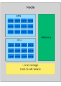
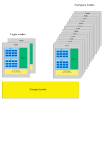

# Brief introduction to HPC environments {.title}

<small>
All materials (c) 2020-2026 by CSC – IT Center for Science Ltd.
This work is licensed under a **Creative Commons Attribution-ShareAlike** 4.0
Unported License, [http://creativecommons.org/licenses/by-sa/4.0/](http://creativecommons.org/licenses/by-sa/4.0/)
</small>

# Notes on vocabulary

- You can roughly think that one **node** is a single computer
- A node on a supercomputer contains:
  - One or more central processing units (**CPUs**) with many **cores**
  - Shared **memory**
- Some nodes may also have:
  - **Local storage** (NVMe)
  - Graphics processing units (**GPUs**)

{width=60%}

# Cluster systems

- Login nodes are used to set up jobs (and to launch them)
- Jobs are run on the compute nodes
- A batch job system (scheduler) is used to run and manage the jobs
  - On CSC machines, we use **Slurm**
  - Note: Slurm uses term CPU for cores, which is a bit confusing

{width=80%}

# Available HPC and cloud resources

- [Roihu](https://docs.csc.fi/computing/systems-roihu/) is CSC's new national supercomputer, replacing Puhti and Mahti ☑️
- [Puhti](https://docs.csc.fi/computing/systems-puhti/) and [Mahti](https://docs.csc.fi/computing/systems-mahti/) compute services have been shut down, but their storage remains accessible for data migration
- [LUMI](https://docs.lumi-supercomputer.eu/hardware/) is a European pre-exascale supercomputer operated by CSC
- [Pouta](https://docs.csc.fi/cloud/pouta/) provides cloud resources via OpenStack (IaaS)
- [Rahti](https://docs.csc.fi/cloud/rahti/get-started/what-is-rahti/) provides containers via OKD (PaaS)
- [Allas](https://docs.csc.fi/data/Allas/) provides object storage for all services

# Which supercomputer to use? 

- What kind of resources can _your application_ use?
  - Can it use more than one core?
  - How much memory will it need?
  - Can it use a GPU or an NVMe?
  - What takes long (i.e., the time-limiting part) in your job?
- See what kind of resources are _available_?
  - Is my code already installed?
  - Max runtime, partitions (queues), provisioning policy (Per core/per node/other)
  - Each system is different, so check the documentation

# Quick and dirty comparison of Roihu and LUMI

|                             | [Roihu](https://docs.csc.fi/computing/systems-roihu/)  | [LUMI](https://docs.lumi-supercomputer.eu/hardware/) |
| ----------------------------------- |------- | ---- |
| Pre-installed apps | [100+](https://docs.csc.fi/apps/by_availability/#roihu) | [See here](https://docs.lumi-supercomputer.eu/software/)
| Cores per node              | 64-384 | 128
| Job size (min-max cores)    | 1-23040    | 1-65536
| Memory per node (GiB)       | 384-6144 | 256-1024
| GPU cards          | 528 (GH200) | 11912 (MI250X)
| Nodes with NVMe (CPU+GPU) | 486+132  | 8+8
