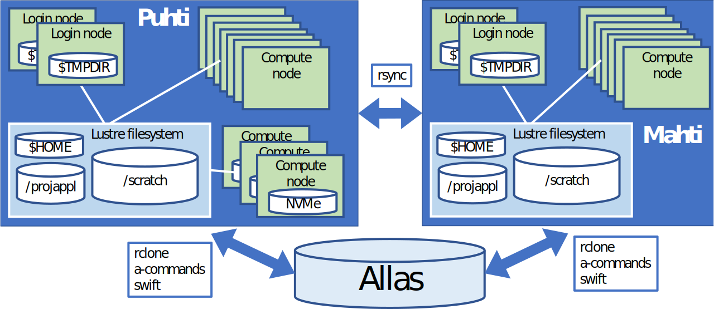
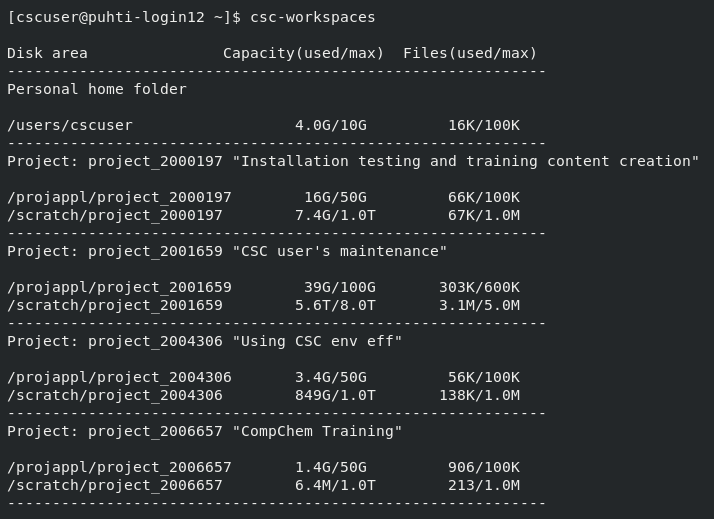

# Disk areas in CSC's HPC environment {.title}
In this section, you will learn how to work in different disk areas in CSC's HPC environment

<small>
All materials (c) 2020-2024 by CSC – IT Center for Science Ltd.
This work is licensed under a **Creative Commons Attribution-ShareAlike** 4.0
Unported License, [http://creativecommons.org/licenses/by-sa/4.0/](http://creativecommons.org/licenses/by-sa/4.0/)
</small>

# Overview of disk areas

- Main disk areas and their specific uses on Puhti and Mahti
   - [See here for information about the disk areas on LUMI](https://docs.lumi-supercomputer.eu/storage/)
- Moving data between supercomputers
- Understanding quotas (available space and number of files) of different disk areas
- Additional fast disk areas

# Disk and storage overview  

{width=90%}

# Main disk areas in Puhti/Mahti

- Home directory (`$HOME`)
    - Other users cannot access your home directory
- ProjAppl directory (`/projappl/project_name`)
    - Shared with project members
    - Possible to limit access (`chmod g-rw`) to subfolders
- Scratch directory (`/scratch/project_name`)
    - Shared with project members
    - Files older than 180 days will be automatically removed
- These directories reside on the [Lustre parallel file system](https://docs.csc.fi/computing/lustre/)
- Default quotas and more info in [disk areas section of Docs CSC](https://docs.csc.fi/computing/disk/)

# Moving data between and to/from supercomputers

- Puhti and Mahti have separate file systems
- Data can be moved between the supercomputers
    - [directly with rsync](https://docs.csc.fi/data/moving/rsync/)
    - via [Allas object storage](https://docs.csc.fi/data/Allas/)
- There are [many ways to transfer data between the CSC supercomputers and your local computer](https://docs.csc.fi/data/moving/)

# Displaying current status of disk areas

- Use the `csc-workspaces` command to show available projects and quotas

{width=50%}

# Disk and storage overview (revisited) 

{width=90%}

# Additional fast local disk areas 

- [`$TMPDIR` on login nodes](https://docs.csc.fi/computing/disk/#login-nodes)
    - Each of the login nodes have 2900 GiB of fast local storage in `$TMPDIR`
    - The local disk is meant for temporary storage (_e.g._ compiling software) and is cleaned frequently
- [NVMe disks on some compute nodes on Puhti](https://docs.csc.fi/computing/running/creating-job-scripts-puhti/#local-storage)
    - Interactive, I/O and GPU nodes have fast local disks (NVMe) in `$LOCAL_SCRATCH`
    - Also, the [GPU nodes on Mahti](https://docs.csc.fi/computing/running/creating-job-scripts-mahti/#gpu-batch-jobs) have fast local storage available
    - You must copy data to and from the fast disk during your batch job since the NVMe is accessible only during your job allocation
    - If your job reads and/or writes a lot of small files, using this can give a huge performance boost!

# What are the different disk areas for?

- [Allas](https://docs.csc.fi/data/Allas/) -- for data which is not actively used
- [`$HOME`](https://docs.csc.fi/computing/disk/#home-directory) -- small, only for the most important (small) files, personal access only
- [`/scratch`](https://docs.csc.fi/computing/disk/#scratch-directory) -- main working area, shared with project members, only for data in active use
- [`/projappl`](https://docs.csc.fi/computing/disk/#projappl-directory) -- not cleaned up, _e.g._ for shared binaries
- [Login node `$TMPDIR`](https://docs.csc.fi/computing/disk/#login-nodes) -- compiling, temporary storage, fast I/O
- [Compute node NVMe `$LOCAL_SCRATCH`](https://docs.csc.fi/computing/running/creating-job-scripts-puhti/#local-storage) -- fast I/O in batch jobs

# Best practices

- None of the disk areas are automatically backed up by CSC, so make sure to perform regular backups to, _e.g._, Allas
- Don't run databases or Conda on Lustre (`/projappl`, `/scratch`, `$HOME`)
    - Containerize Conda environments with [Tykky](https://docs.csc.fi/computing/containers/tykky/) and use other CSC services like [Kaivos](https://docs.csc.fi/data/kaivos/overview/) or [cPouta](https://docs.csc.fi/cloud/pouta/) for databases (Rahti also an option but connecting to it from Puhti/Mahti is complicated)
- Don't create a lot of files, especially within a single folder
    - If you're creating 10 000+ files, you should probably rethink your workflow
- Consider using fast local disks when working with many small files
- [Lustre best practices](https://docs.csc.fi/computing/lustre/#best-practices) and [efficient I/O in high-throughput workflows](https://docs.csc.fi/computing/running/throughput/#inputoutput-efficiency)
