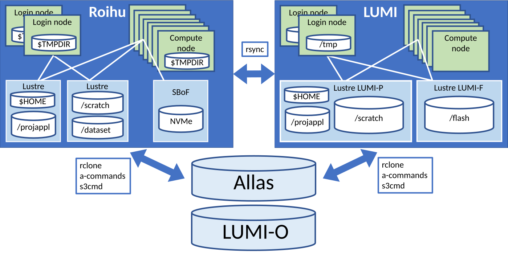
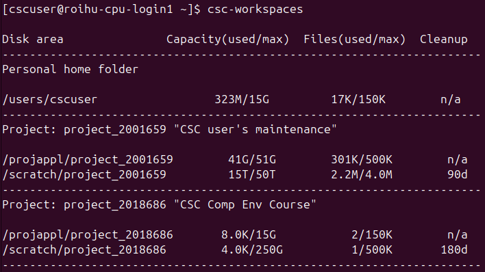

# Disk areas in CSC's HPC environment {.title}
In this section, you will learn how to work in different disk areas in CSC's HPC environment

<small>
All materials (c) 2020-2026 by CSC – IT Center for Science Ltd.
This work is licensed under a **Creative Commons Attribution-ShareAlike** 4.0
Unported License, [http://creativecommons.org/licenses/by-sa/4.0/](http://creativecommons.org/licenses/by-sa/4.0/)
</small>

# Overview of disk areas

- Main disk areas and their specific uses on Roihu
   - [See here for information about the disk areas on LUMI](https://docs.lumi-supercomputer.eu/storage/)
- Moving data between supercomputers
- Understanding quotas (available space and number of files) of different disk areas
- Additional fast disk areas

# Disk and storage overview  

# Main disk areas in Roihu

- Personal home directory (`$HOME`)
- ProjAppl directory (`/projappl/project_name`)
    - Shared with project members
    - Possible to limit access (`chmod g-rw`) to subfolders
- Scratch directory (`/scratch/project_name`)
    - Shared with project members
    - Files not accessed for 90 days (5+ TiB quota) or 180 days (smaller quotas) are [removed periodically](https://docs.csc.fi/computing/usage-policy/#disk-cleaning)
- These directories reside on the [Lustre parallel file system](https://docs.csc.fi/computing/lustre/)
- Default quotas and more info in [disk areas section of Docs CSC](https://docs.csc.fi/computing/roihu-disk/)

# Dataset projects in Roihu

- Roihu users can apply for separate dataset projects

- Intended for data sharing and active use, not long-term storage

- Dataset projects provide access to shared disk area under (`/dataset/project_name`) but have no computational resources

- Write access to a dataset directory is restricted to a single project, while multiple other projects can be granted read access to this disk area.

# Moving data between and to/from supercomputers

- Roihu and LUMI have separate file systems
- Data can be moved between the supercomputers
    - [directly with rsync](https://docs.csc.fi/data/moving/rsync/) (remember [SSH agent forwarding](https://docs.csc.fi/computing/connecting/ssh-unix/#ssh-agent-forwarding))
    - via [Allas object storage](https://docs.csc.fi/data/Allas/)
- There are [many ways to transfer data between the CSC supercomputers and your local computer](https://docs.csc.fi/data/moving/)

# Displaying current status of disk areas

- Use the `csc-workspaces` command to show available projects and quotas

{width=50%}

# Disk and storage overview (revisited) 

# Additional fast local disk areas 

- [`$TMPDIR` on login nodes](https://docs.csc.fi/computing/disk/#login-nodes)
    - Each of the login nodes have 80 GiB of fast local storage (per user) in `$TMPDIR`
    - The local disk is meant for temporary storage (_e.g._ compiling software) and is cleaned frequently
- [NVMe disks on compute nodes on Roihu](https://docs.csc.fi/computing/disk/#compute-nodes-with-local-ssd-nvme-disks)
    - All compute nodes have fast local disks (NVMe) in `$TMPDIR`
    - You must copy data to and from the fast disk during your batch job since the NVMe is accessible only during your job allocation
    - If your job reads and/or writes a lot of small files, using this can give a huge performance boost!

# Disaggregated storage / smart bunch of flash (SBoF)

- Fast storage for compute jobs, similarly to compute node NVMe
- Available in larger quantities than the local NVMe on compute nodes
- Needs to be requested in the batch job script
- You must copy data to and from the fast disk during your batch job since the storage is accessible only during your job allocation

# What are the different disk areas for? 1/2

- [Allas](https://docs.csc.fi/data/Allas/) -- for data which is not actively used
- [`$HOME`](https://docs.csc.fi/computing/roihu-disk/#home-directory) -- small, for the most important (small) files, personal access only
- [`/scratch`](https://docs.csc.fi/computing/roihu-disk/#scratch-directory) -- main working area, shared with project members, only for data in active use
- [`/projappl`](https://docs.csc.fi/computing/roihu-disk/#projappl-directory) -- not cleaned up, _e.g._ for shared binaries
- [`/dataset`](https://docs.csc.fi/computing/roihu-disk/#dataset-directory) -- dataset projects for sharing data between mutiple projects

# What are the different disk areas for? 2/2

- [Login node `$TMPDIR`](https://docs.csc.fi/computing/roihu-disk/#login-nodes) -- compiling, temporary storage, fast I/O
- [Compute node NVMe `$TMPDIR`](https://docs.csc.fi/computing/roihu-disk/#compute-nodes) -- fast I/O in batch jobs
- [SBoF](https://docs.csc.fi/computing/roihu-disk/#disaggregated-storage) -- fast I/O in batch jobs for large amounts of data

# Best practices

- None of the disk areas are automatically backed up by CSC, so make sure to perform regular backups to, _e.g._, Allas
- Don't run databases or Conda on Lustre (`/projappl`, `/scratch`, `$HOME`, `/dataset`)
    - Containerize Conda environments with [Tykky](https://docs.csc.fi/computing/containers/tykky/) and use other CSC services like [Pukki](https://docs.csc.fi/cloud/dbaas/), [cPouta](https://docs.csc.fi/cloud/pouta/) or [Rahti](https://docs.csc.fi/cloud/rahti/) for databases
- Don't create a lot of files, especially within a single folder
    - If you're creating 10 000+ files, you should probably rethink your workflow
- Consider using fast local disks when working with many small files
- [Lustre best practices](https://docs.csc.fi/computing/lustre/#best-practices) and [efficient I/O in high-throughput workflows](https://docs.csc.fi/computing/running/throughput/#other-considerations)
