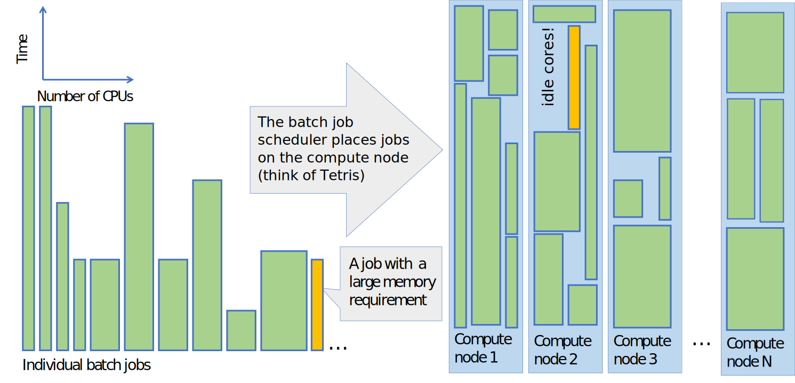
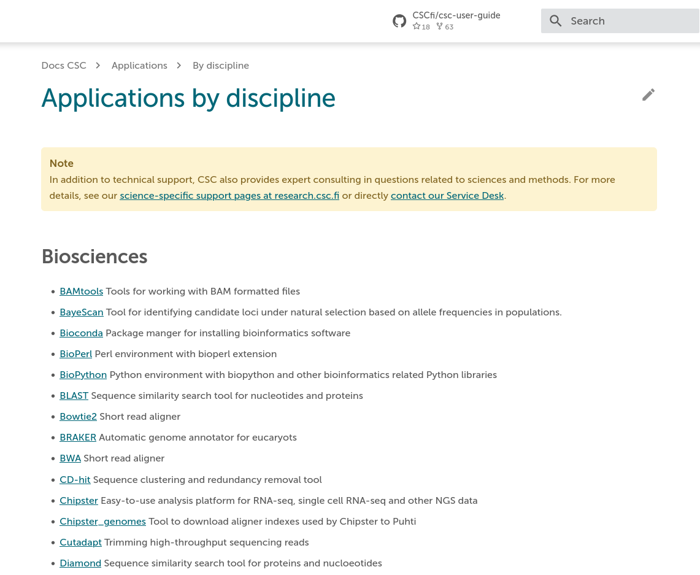

# The batch job system in CSC's HPC environment {.title}

<div class="column">

</div>
<div class="column">
<small>
All materials (c) 2020-2024 by CSC – IT Center for Science Ltd.
This work is licensed under a **Creative Commons Attribution-ShareAlike** 4.0
Unported License, [http://creativecommons.org/licenses/by-sa/4.0/](http://creativecommons.org/licenses/by-sa/4.0/)
</small>
</div>

# What is a batch job? 1/2

- On a laptop you might be used to start a program (job) by clicking an icon, which starts the job instantly
- If we start many jobs at the same time, we occasionally encounter problems like running out of memory _etc._
- In an HPC environment, the computer is shared among hundreds to thousands of other users who all have different resource needs
- HPC batch jobs include a resource request, which corresponds to an **estimate of how much resources the job is expected to use**

# What is a batch job? 2/2

- A batch job consists of two parts: A resource request and the actual computing step
- A job does not start directly, but is sent to a _queue_
- Depending on the requested resources and current load on the system, the job may need to wait for a while before starting
- At CSC (and HPC systems in general), all heavy computing **must** be done via batch jobs (see our [usage policy](https://docs.csc.fi/computing/usage-policy/))

# What is a batch job system?

- A resource management system that keeps track of all jobs that use, or would like to use, the computing resources
- Aims to share the resources in an efficient and fair way among all users
- Optimizes resource usage by filling the compute nodes so that there will be as little idling resources as possible

# Queueing and fair share of resources

- A job is queued and starts when the requested resources become available
- The order in which the queued jobs start depends on their priority and currently available resources
- At CSC, the priority is configured to use "fair share"
   - The _initial_ priority of a job _decreases_ if the user has recently run lots of jobs
   - Over time (while queueing) its priority _increases_ and eventually it will run
   - Some queues have a lower priority (e.g. _longrun_ -- use shorter if you can!)
- See our documentation for more information on [Getting started with running batch jobs on Puhti/Mahti](https://docs.csc.fi/computing/running/getting-started/) and [LUMI](https://docs.lumi-supercomputer.eu/runjobs/).

# Schema of how the batch job scheduler works



# The batch job system in CSC's HPC environment

- CSC uses a batch job system called [Slurm](https://slurm.schedmd.com/sbatch.html) to manage resources
- Slurm is used to control how the overall computing resources are shared among all jobs in an efficient and fair manner
- Slurm controls how a single job request is allocated resources, such as:
    - computing time
    - number of cores
    - amount of memory
    - other resources like GPUs, local disk, _etc._
- Getting started with Slurm batch jobs on [Puhti/Mahti](https://docs.csc.fi/computing/running/getting-started/) and [LUMI](https://docs.lumi-supercomputer.eu/runjobs/scheduled-jobs/slurm-quickstart/)

# An example serial batch job script for Puhti

- A batch script is a shell script (bash) that consists of two sections:
   - Resource requests flagged with `#SBATCH` and the actual computing step(s)

```bash
#!/bin/bash
#SBATCH --job-name=print_hostname   # Defines the job name shown in the queue
#SBATCH --time=00:01:00             # Defines the max time the job can run
#SBATCH --partition=test            # Defines the queue in which to run the job
#SBATCH --ntasks=1                  # Defines the number of tasks (processes)
#SBATCH --cpus-per-task=1           # Total number of cores is ntasks * cpus-per-task
#SBATCH --account=<project>         # Defines the billing project, e.g. project_2001234 (mandatory field)

srun echo "Hello $USER! You are on node $HOSTNAME"
```

- The options are described in Docs CSC: [Create Puhti batch jobs](https://docs.csc.fi/computing/running/creating-job-scripts-puhti/)
   - The actual _program_ is launched using the `srun` command
   - The content above could be copied into a file `serial.bash` and submitted to the queue with `sbatch simple_serial.bash`

# Using an application-specific batch script template

<div class="column">

- The [application pages in Docs CSC](https://docs.csc.fi/apps/) contain example scripts for some software
- Use these as the *starting point* for your own scripts
- They have been tested and optimized (although for minimal resources) for _that_ application
   - Consult the official manual or other examples to adapt to your own needs
   - Ask for support: <servicedesk@csc.fi>

</div>

<div class="column">

{width=100%}
</div>

# Submitting, cancelling and status of batch jobs

- A batch job script is submitted to the queue with the command:
   - `sbatch example_job.sh`
- List all your jobs that are queuing/running:
   - `squeue -u $USER`
- Detailed info of a queuing/running job:
   - `scontrol show job <jobid>`
- A job can be deleted using the command:
   - `scancel <jobid>`
- Display the resource usage and efficiency of a completed job:
   - `seff <jobid>`

# Available batch job partitions

- [The available batch job partitions](https://docs.csc.fi/computing/running/batch-job-partitions/) are listed in Docs CSC
   - The Slurm partitions available on LUMI are detailed in the [LUMI documentation](https://docs.lumi-supercomputer.eu/runjobs/scheduled-jobs/partitions/).
- In order to use the resources efficiently, it is important to estimate the resource request as accurately as possible
- By avoiding excessive "just-in-case" requests, the job will start earlier

# Different types of HPC jobs

- Typically, an HPC job can be classified as serial, parallel or GPU, depending on the main requested resources
- The following slides will present an overview of different job types
- A serial job is the simplest type of job, whereas parallel and GPU jobs require advanced software and programming methods to fully utilise their capacity
   - Note that GPU-jobs are in principle also parallel, but they run on different hardware (GPUs instead of CPUs) and are programmed differently
- If you use pre-installed applications, please ensure what kind of resources they need to run efficiently (serial, parallel or GPU)

# HPC serial jobs

- A serial software can only use a single core, so don't reserve more!
- Why could your serial job benefit from being run using CSC's resources instead of on your own computer?
    - Part of a larger workflow (high-throughput computing)
    - Avoid data transfer between the supercomputers and your own computer
    - Data sharing among other project members
    - CSC's software licensing
    - Pre-installed software
    - Memory and/or disk demands

# Running multiple serial jobs

- You can utilize HPC resources for running multiple independent serial jobs at the same time (task farming)
    - [Array jobs](https://docs.csc.fi/computing/running/array-jobs/)
    - [Other high-throughput tools](https://docs.csc.fi/computing/running/throughput/)
- Pure serial resources are only available in Puhti
    - Some tools, e.g. [HyperQueue](https://docs.csc.fi/apps/hyperqueue/), can make a set of serial jobs suitable for Mahti
    - **But**, the workflow needs to fill (at least) one Mahti node and keep the CPUs busy for the job duration
- When running many jobs, make sure that you don't overload the batch queue system or the parallel file system (mind your I/O and job steps)!

# HPC parallel jobs

- A parallel job distributes the calculation over several cores in order to achieve a shorter wall-time (and/or a larger allocatable memory)
   - The total computational problem is divided into subtasks, which are processed by each core in parallel
- There are two major parallelization standards: [OpenMP](https://en.wikipedia.org/wiki/OpenMP) and [MPI](https://en.wikipedia.org/wiki/Message_Passing_Interface)
   - Note, depending on the parallellization scheme there is a slight difference between _how_ the resource reservation is done
- Batch job scripts for Puhti ([how to create](https://docs.csc.fi/computing/running/creating-job-scripts-puhti/) and [examples](https://docs.csc.fi/computing/running/example-job-scripts-puhti/)), Mahti ([how to create](https://docs.csc.fi/computing/running/creating-job-scripts-mahti/) and [examples](https://docs.csc.fi/computing/running/example-job-scripts-mahti/)) and LUMI ([quickstart](https://docs.lumi-supercomputer.eu/runjobs/scheduled-jobs/slurm-quickstart/), [CPU](https://docs.lumi-supercomputer.eu/runjobs/scheduled-jobs/lumic-job/) and [GPU examples](https://docs.lumi-supercomputer.eu/runjobs/scheduled-jobs/lumig-job/))
- **The best starting point:** [Software specific batch scripts in Docs CSC](https://docs.csc.fi/apps/)

# HPC GPU jobs

- A graphics processing unit (GPU, a graphics card), is capable of doing a certain type of simultaneous calculations _very_ efficiently
- In order to take advantage of this power, an application must be (re)programmed to adapt to how the GPUs process data
- CSC's GPU resources on Puhti and Mahti are relatively scarce and should be used only by applications [that really benefit from GPUs](https://docs.csc.fi/computing/usage-policy/#gpu-nodes)
    - A GPU on Puhti/Mahti uses 60 times more billing units than a single CPU core - see above for performance requirements
    - In practice, 1-10 CPUs (but not more) should be allocated per GPU on Puhti
    - Note that [LUMI-G](https://docs.lumi-supercomputer.eu/hardware/compute/lumig/) has a massive GPU capacity available, which is also "cheaper" as measured in BUs compared to Puhti/Mahti

# Interactive jobs

- When you login to CSC's supercomputers, you end up on one of the login nodes of the supercomputer
    - These login nodes are shared by all users and they are [not intended for heavy computing](https://docs.csc.fi/computing/usage-policy/)
- If you have a heavier job that still requires interaction
    - Request resources from the [interactive partition](https://docs.csc.fi/computing/running/interactive-usage/) using the `sinteractive` command
    - This will open an interactive shell where you can perform your computations directly on a compute node instead of the login node
- Interactive jobs and GUIs can also be launched in the [web interfaces](https://docs.csc.fi/computing/webinterface/)
    - Jupyter notebooks, RStudio, TensorBoard, MATLAB, VSCode, ...
