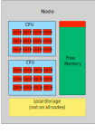
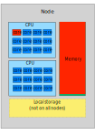
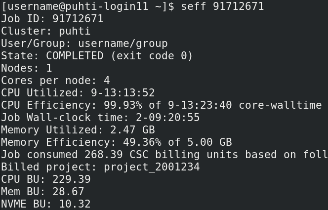
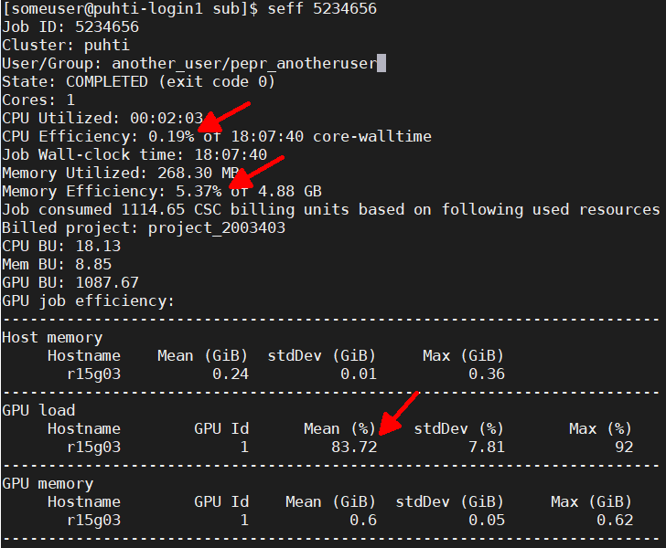
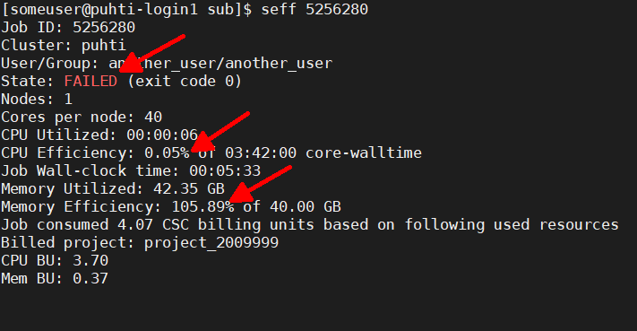

# Understanding resource usage {.title}

This lecture helps you to optimize your resource usage in CSC's HPC environment.

<small>
All materials (c) 2020-2024 by CSC – IT Center for Science Ltd.
This work is licensed under a **Creative Commons Attribution-ShareAlike** 4.0
Unported License, [http://creativecommons.org/licenses/by-sa/4.0/](http://creativecommons.org/licenses/by-sa/4.0/)
</small>

# Optimal usage on multi-user computing platforms

- The computing resources are shared among hundreds of your colleagues, who all have different resource needs
- Resources allocated to your job are not available for others to use
   - Important to request only the resources you need and ensure that the resources are used efficiently
- Even if you _can_ use more resources, should you?

# One resource type will be a bottleneck

- A single node can host many jobs from different users
- Different jobs need different resources
- Typically, the cores run out before the memory does
- Sometimes a job uses only one core, but will consume all memory
   - No further jobs will fit in the node
   - If the job is _not_ using the memory (just reserving it), resources are wasted

{width=45%}
{width=45%}

# Slurm accounting: batch job resource usage 1/2

- Resource usage can be queried with `seff <slurm jobid>`
- Points to pay attention to:
   - Low CPU Efficiency:
      - Too many cores requested?
      - Cores waiting for other processes?
      - Cores waiting for data from disk?
      - Cores spread over too many nodes?
   - Low Memory Efficiency:
      - Too much memory requested?
      - Lots of caveats here
   - Low GPU efficiency:
      - Better to use CPUs? Disk I/O?

{width=90%}

# Slurm accounting: batch job resource usage 2/2

- Not all usage is captured by Slurm accounting
   - If CPU efficiency seems too low, look at the completion time
   - Some applications also print timing data in log files
   - Jobs launched without `srun` don't record properly (e.g. `orterun`)
- More detailed queries can be tailored with `sacct`
   - `sacct -j <slurm jobid> -o jobid,partition,state,elapsed,start,end`
   - `sacct -S 2022-08-01` will show all jobs started after that date
   - Note! Querying data from the Slurm accounting database with `sacct` can be a very heavy operation
      - **Don't** query long time intervals or run `sacct` in a loop/using `watch` as this will degrade the performance of the system for all users

# Billing units

- CPU time and storage space consume "[Billing units](https://docs.csc.fi/accounts/billing/)" (BU)
- BUs are a property of computing projects, not users
- Monitor the BU usage of your project(s) from the command-line with `csc-projects`
   - For help/options, try `csc-projects -h`
- Batch job billing scheme:
   - Amount of resources allocated: All requested resources are billed, i.e. number of cores, amount of memory, NVMe, ...
   - Time allocated: Resources are billed based on the actual (wall) _time_ a job has **used**, not the reserved maximum time

# Applying for Billing units

- Billing units can be applied via the [Projects page in My CSC](https://my.csc.fi/welcome)
   - Please acknowledge using CSC resources in your publications
   - Please also inform us about your work by adding your publications to the resource application!
- Academic usage is one of the [free-of-charge use cases](https://research.csc.fi/pricing)
- You can estimate [usage with the online billing calculator](https://research.csc.fi/billing-and-monitoring#buc)
   - The calculator can also be used to estimate the value of the resources
- For companies interested in using CSC's HPC services, please see our [solutions for business](https://www.csc.fi/solutions-for-business)
   - [LUMI](https://www.lumi-supercomputer.eu/) has a substantial amount of [affordable](https://www.csc.fi/en/solutions-for-business-use-of-computing-services-and-pricing) computing resources (especially GPUs) available for industrial use!

# BUs are also a metric for comparing usage efficiency

- Different resources have different rates
   - 1 CPU core hour on Puhti equals 1 BU
   - 1 GPU card hour on Puhti equals 60 BU (+ allocated CPU cores)
   - 1 node hour on Mahti equals 100 BU
   - 1 GiB hour of Memory on Puhti equals 0.1 BU
   - 1st TiB of disk quota (`/scratch`, `/projappl`) is free-of-charge (0 BU)
      - Applied excess quota is billed by 5 BU/TiBh. (5 billing units per TiB per hour)
   - 1 used TiB hour in Allas equals 1 BU (i.e. 1 TiB of data consumes 8760 BU per year)
   - [This and other service billing information in Docs CSC](https://docs.csc.fi/accounts/billing/)
   - For LUMI billing policy, [see the LUMI documentation](https://docs.lumi-supercomputer.eu/runjobs/lumi_env/billing/)

# Before starting large-scale calculations

- Check how the software and your actual input performs
    - Common job errors are caused by typos in batch/input scripts
- Use short runs in the queue `--partition=test` to check that the input works and that the resource requests are interpreted correctly
- Check the output of the `seff` command to ensure that CPU and memory efficiencies are as high as possible
    - It's OK if a job is (occasionally) killed due to insufficient resource requests: just adjust and rerun/restart
    - It's _much worse_ to always run with excessively large requests "just in case"

# Parallelizing your workflow

- There are multiple ways to parallelize your workflow
   - Maybe several smaller jobs are better than one large (task farming)?
   - Is there a more efficient code or algorithm?
   - Is the file I/O slowing you down (lots of read/write operations)?
- Optimize usage considering single job wall-time, overall used CPU time, I/O
- [Docs CSC: Guidelines for high-throughput computing](https://docs.csc.fi/computing/running/throughput/)

# Reserving and optimizing batch job resources

- **Important resource requests that should be monitored with `seff` are:**
   - [Memory requirements](https://docs.csc.fi/support/faq/how-much-memory-my-job-needs/)  
   - [Disk workload](https://docs.csc.fi/computing/running/creating-job-scripts-puhti/#local-storage)
   - [GPU efficiency](https://docs.csc.fi/computing/usage-policy/#gpu-nodes)
   - [Scaling of a job over several cores and nodes](https://docs.csc.fi/computing/running/performance-checklist/#perform-a-scaling-test)
      - Parallel jobs must always benefit from all requested resources
      - When you double the number of cores, the job should run _at least_ 1.5x faster

# `seff` examples

{width=90%}

- Left: GPU usage ok! (for _this_ example other metrics also ok)
- Bottom: CPU usage way too low, memory usage too high, job killed

{width=90%}

