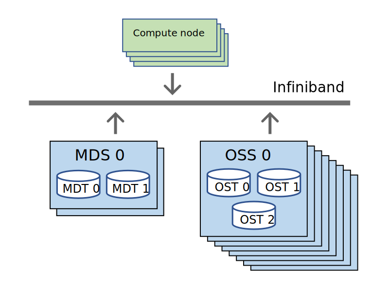

# Working efficiently with data {.title}
         
<div class="column">

</div>
<div class="column">
<small>
All materials (c) 2020-2024 by CSC – IT Center for Science Ltd.
This work is licensed under a **Creative Commons Attribution-ShareAlike** 4.0
Unported License, [http://creativecommons.org/licenses/by-sa/4.0/](http://creativecommons.org/licenses/by-sa/4.0/)
</small>
</div>

# Outline

- Efficient file I/O in HPC systems
- Using Allas in batch scripts 
- Moving data to/from Allas, IDA and LUMI-O
- Transferring data in sensitive data computing
- Cleaning and backing up data 
- Working with remote mounts

# Parallel file systems

- A parallel file system (PFS) provides a common file system area that can be accessed from all nodes in a cluster
- Without PFS users would have to always copy all needed data to compute nodes before runs (cf. local disk)
    - Also the results would not be visible outside the compute node
- CSC uses **Lustre** parallel file system Puhti and Mahti

# Lustre

<div class=column style="width:43%">
{width=100%}
</div>
<div class=column style="width:55%">
- One or more metadata servers (MDS) with metadata targets (MDT) that store the file system metadata
- One or more object storage servers (OSS) with object storage targets (OST) that store the actual file system contents
- Connection to nodes via the high-speed interconnect (InfiniBand)
</div>

# What happens when you access a file?

<div class=column style="width:43%">
{width=100%}
</div>
<div class=column style="width:55%">
1. Send metadata request
2. Response with metadata
3. Request data
4. Data response
</div>

# Managing file I/O (1/3)

- Parallel file system (Lustre):
   - Shared across all nodes in the cluster (e.g., `/scratch`)
   - Optimized for parallel I/O of large files, slow if accessing lots of small files!
- [Temporary local storage (NVMe)](https://docs.csc.fi/computing/disk/#temporary-local-disk-areas):
   - Accessible on login nodes (`$TMPDIR`) and to jobs on some compute nodes (`$LOCAL_SCRATCH`)
   - Automatically purged after the job finishes
   - Availability varies depending on the supercomputer (Puhti/Mahti/LUMI)
     - For example, Mahti has NVMe only on login nodes and GPU nodes

# Managing file I/O (2/3)

- To avoid on Lustre:
   - Accessing lots of small files, opening/closing a single file in a rapid pace
   - Having many files in a single directory
- Use [file striping](https://docs.csc.fi/computing/lustre/#file-striping-and-alignment) to distribute large files across many OSTs
- Use more efficient file formats when possible
   - Simply using `tar` and compression is a good start
   - High-level I/O libraries and portable file formats like HDF5 or NetCDF
     - Enable fast I/O through a single file format and parallel operations
     - [AI/ML example: TensorFlow's TFRecords](https://github.com/CSCfi/machine-learning-scripts/blob/master/notebooks/tf2-pets-create-tfrecords.ipynb) – a simple record-oriented binary format
- Docs CSC: [How to achieve better I/O performance on Lustre](https://docs.csc.fi/support/tutorials/lustre_performance/)

# Managing file I/O (3/3)

- Use fast local disk to handle file I/O with lots of small files
   - Requires staging and unstaging of data
   - `tar xf /scratch/<project>/big_dataset.tar.gz -C $LOCAL_SCRATCH`
- Processing data in memory allows better performance compared to writing to and reading from the disk
   - "Ramdisk" (`/dev/shm`) can be used on Mahti nodes without NVMe
   - `export TMPDIR=/dev/shm`
- Do not use databases on `/scratch`
   - Instead, consider hosting DBs on cloud resources (e.g., [Pukki DBaaS](https://docs.csc.fi/cloud/dbaas/))

# Using Allas in batch jobs

- Swift (all projects, 8-hour) *vs*. S3 protocol (fixed for a project, persistent)
- `allas-conf` needs setting up CSC password interactively
   - Jobs may start late and actual job may take longer than 8 hrs
- Use `allas-conf -k`
   - stores password in variable `$OS_PASSWORD` to generate a new token automatically
     - a-tools regenerate a token using `$OS_PASSWORD` automatically
     - `rclone` requires explicitly setting environment variable in batch jobs:
      ```bash
      source /appl/opt/allas-cli-utils/allas_conf -f -k $OS_PROJECT_NAME
      ```

# Configuring Allas for S3 protocol

- Opening Allas connection in s3mode
  - `source allas_conf --mode s3cmd`
- Connection is persistent
- Usage:
   - `s3cmd` with endpoint `s3:`
   - `rclone` with endpoint `s3allas:`
   - `a-put`/`a-get` with `-S` flag

# How to use LUMI-O from Puhti/Mahti

- LUMI-O is very similar to Allas, but it uses only S3 protocol
- In Puhti and Mahti, connection to LUMI-O can be opened with command:
  - `allas-conf --lumi`
- Usage:
  - Using LUMI-O with `rclone` (endpoint is `lumi-o:`)
    - e.g., `rclone lsd lumi-o:`
  - One can use a-tools with option `--lumi`
    - e.g., `a-list --lumi`
- Docs CSC: [Using Allas and LUMI-O from LUMI](https://docs.csc.fi/data/Allas/allas_lumi/)


# Moving data between LUMI-O and Allas 

- Requires activating connections to both LUMI-O and Allas at the same time:
    - `allas-conf --mode s3cmd` 
    - `allas-conf --lumi`
- Use `rclone` with `s3allas:` as endpoint for Allas and `lumi-o`: for LUMI-O
    - `rclone copy -P lumi-o:lumi-bucket/object s3allas:allas-bucket/`

# Moving data between IDA and Allas 

- Needs transfer of data *via* supercomputer (e.g., Puhti)
- First, [configure IDA in CSC supercomputers](https://docs.csc.fi/data/ida/using_ida/). For example:

```bash
module load ida
ida_configure
ida upload /test123/data1 test_data
ida download /project1 project1_data.zip
```

- Then, move data between Puhti and Allas

# Transferring data for sensitive data computing

- CSC sensitive data services: SD Connect and SD Desktop, use service-specific encryption
- SD Desktop is able to read encrypted data from Allas
   - If you want to make your data available in SD Desktop, you need to encrypt the data with the *CSC public key* before data is uploaded to Allas
   - Use `a-put` with option `--sdx` or command `a-encrypt` to make your Allas data compatible with SD Desktop
   - Upcoming version of SD Connect will change the situation, but new server will be compatible with previously uploaded data as well

# Questions that users should consider

- Should I store each file as a separate object, or should I collect them into bigger chunks? 
   - In general: consider how you use the data
- Should I use compression?
- Who can use the data: projects and access rights?
- What will happen to my data later on?
- How to keep track of all the data I have in Allas?

# Cleaning and backing up data (1/3)

- **[Disk cleaning](https://docs.csc.fi/support/tutorials/clean-up-data/#automatic-removal-of-files)**
  - In force for project disk areas under `/scratch` **on Puhti**
  - Files older than 180 days will be removed periodically
    - Listed in a purge list, e.g. `/scratch/purge_lists/project_2001234/path_summary.txt`
    - *[LCleaner](https://docs.csc.fi/support/tutorials/clean-up-data/#using-lcleaner-to-check-which-files-will-be-automatically-removed)* tool can help you discover which of your files have been targeted for automatic removal
- **Best practice tips**
  - Don't save everything automatically
  - Use *[LUE](https://docs.csc.fi/support/tutorials/lue/)* tool to analyze your disk usage
    - Avoid `du` and `find -size`, these commands are heavy on the file system
  - Move important data not in current use to Allas

# Cleaning and backing up data (2/3)

- [`allas-backup`](https://docs.csc.fi/data/Allas/using_allas/a_backup/) command provides an easy-to-use command-line interface for the `restic` backup tool
- Backing up differs from normal storing:
  - Incremental (efficient) and version control (no overriding)
  - Based on hashes and requires more computing
  - Efficient way to store different versions of a dataset

# Cleaning and backing up data (3/3) 

- Please note that Allas is intended for storing *active data* 
- Project lifetime is usually 1-5 years
- Commands for backing up data:
   - `allas-backup --help`
   - `allas-backup [add] file-or-directory`
   - `allas-backup list `
   - `allas-backup restore snapshot-id`

# Working with remote disk mounts

- Using `sshfs` command in Linux/MacOS:
   - `mkdir csc_home`
   - `sshfs <username>@puhti.csc.fi:/users/<username> csc_home`
- To unmount the file system, give the command: 
   - `fusermount -u csc_home`
