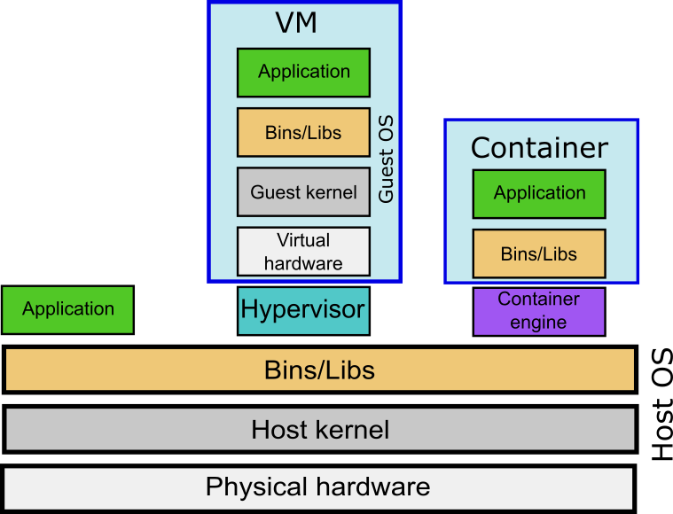

# Introduction to Apptainer/Singularity containers {.title}

<div class="column">

</div>
<div class="column">
<small>
All materials (c) 2020-2024 by CSC – IT Center for Science Ltd.
This work is licensed under a **Creative Commons Attribution-ShareAlike** 4.0
Unported License, [http://creativecommons.org/licenses/by-sa/4.0/](http://creativecommons.org/licenses/by-sa/4.0/)
</small>
</div>

# The one-slide lecture

- Some software packages on the CSC supercomputers are installed as containers
  - May cause some changes to usage
  - See the instructions in Docs CSC for each software for details
- Containers provide an easy way to install software
  - A single-command installation if a suitable Docker or Apptainer/Singularity container exists

# Containers

- Containers are a way of packaging software and their dependencies (libraries, etc.)
- Popular container engines include Docker, Apptainer (previously called Singularity), Shifter, Podman etc
- Apptainer is most popular in HPC environments

# Containers vs. virtual machines (1/2)

<div style="text-align:center"></div>

# Containers vs. virtual machines (2/2)

- Virtual machines can run a totally different OS than the host computer (e.g. Windows on a Linux host or vice versa)
- Containers share the kernel with the host, but they can have their own libraries
  - They can run, e.g., a different Linux distribution than the host

# Benefits of containers: Ease of installation

- Containers are becoming a popular way of distributing software
  - A single-command installation from existing image
  - More portable since all dependencies are included
- Limited root privileges inside the container if the build system supports it
  - Package managers (yum, apt, etc.) can be utilized even when not available on the target system.
  - Some containers need full root access in to build

# Benefits of containers: Environment isolation

- Containers use the host system kernel, but they can have their own bins/libs layer
  - Can be a different Linux distribution than the host
  - Can solve some incompatibilities
  - Less likely to be affected by changes in the host system
  
# Benefits of containers: Enviroment reproducibility

- Environment can be saved as a whole
  - Useful with, e.g., Python, where updating underlying packages (NumPy, etc.) can lead to differences in the behavior  
- Sharing with collaborators is easy (a single file)

# Apptainer in a nutshell

- Containers can be run with user-level rights
  - But: building new containers requires root access or support for `--fakeroot` option
- Minimal performance overhead
- Supports MPI
  - Requires containers tailored to the host system
- Can use host driver stack (Nvidia/CUDA)
  - Add option `--nv`
- Can import and run Docker containers
  - Running Docker directly would require root privileges

# Apptainer on CSC supercomputers

- Apptainer jobs should be run as batch jobs or with `sinteractive`
- No need to load a module
- Users can run their own containers
- Some CSC software installations are provided as containers (e.g. Python environments)
  - See the software pages in Docs CSC for details

# Running Apptainer containers: Basic syntax

- Execute a command in the container
  - `apptainer exec [exec options...] <container> <command>`
- Run the default action (runscript) of the container
  - Defined when the container is built
  - `apptainer run [run options...] <container>`
- Open a shell in the container
  - `apptainer shell [shell options...] <container>`

# File system

- Containers have their own internal file system (FS)
  - The internal FS is always read-only when executed with user-level rights
- To access host directories, they need to be mapped to container directories
  - E.g., to map the host directory `/scratch/project_2001234` to the `/data` directory inside the container: `--bind /scratch/project_2001234:/data`
  - The target directory inside the container does not need to exist, it is created if necessary
  - More than one directory can be mapped

# Environment variables

- Most environment variables from the host are inherited by the container
  - Can be prevented if necessary by adding the option `--cleanenv`
- Environment variables can be set specifically inside the container by setting on the host `$APPTAINERENV_variablename`.
  - E.g., to set `$TEST` in a container, set `$APPTAINERENV_TEST` on the host

# `apptainer_wrapper`

- Running containers with `apptainer_wrapper` takes care of the most common `--bind` commands automatically
- You just need to set the `$SING_IMAGE` environment variable to point to the correct Apptainer image file

```bash
export SING_IMAGE=/path/to/container.sif
apptainer_wrapper exec myprog <options>
```

- Additional options can be set with variable `$SING_FLAGS`, e.g. `export SING_FLAGS=--nv`

# Using Docker containers with Apptainer

- You can build an Apptainer container from a Docker container with normal user rights:
  - `apptainer build <image> docker://<address>:<tag>`
- For example:
  - `apptainer build pytorch_19.10-py3.sif docker://nvcr.io/nvidia/pytorch:19.10-py3`
- More information in our documentation:
  - [Running Apptainer containers](https://docs.csc.fi/computing/containers/run-existing/)
  - [Creating Apptainer containers](https://docs.csc.fi/computing/containers/creating/)
  - [Using Tykky to create Apptainer containers](https://docs.csc.fi/computing/containers/tykky/)
  - [Apptainer containers on LUMI](https://docs.lumi-supercomputer.eu/software/containers/singularity/)

# Apptainer containers as an installation method

- Apptainer is a good option in cases where the installation is otherwise problematic:
  - Complex installations with many dependencies/files
  - Obsolete dependencies incompatible with the native environment
    - Still needs to be kernel-compatible
  - Image is a single file

# Just a random example (FASTX-toolkit)

- Tested installation methods:
  - Native: 47 files, total size 1.9 MB
    - Needed changes to source code to compile
  - Conda: 27464 files, total size  1.1 GB
  - Apptainer: 1 file, total size 339 MB

# Methods of building a new Apptainer container

- Building using [Tykky](https://docs.csc.fi/computing/containers/tykky/))
- Building from a definition (aka recipe) file
- Building in "sandbox" mode

# Building using Tykky

- Especially suited for Conda environments
  - Can take an environment YAML file as an input
- Can be used for any application type
  - Use `--post-install <file>`to run the installation commands
  - See [example](https://github.com/CSCfi/hpc-container-wrapper/blob/master/examples/fftw.md)

# Building using a definition file

- Provides transparency
  - Everybody can see what commands were used to build the container
- Definition files reusable
  - Updating the software typically only requires minor changes to the file
- Can be a bit cumbersome if you have to try many things (e.g. installing missing libraries)  

# Building using sandbox mode

- container created as a directory structure instead of an image file
- Installation done interactively
  - Easier to test different options
- A production image needs to be built for general use
- Resulting image is a "black box"
  - No record left of installation commands used
