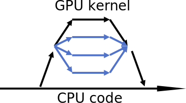

# How to speed up jobs {.title}

<small>
All materials (c) 2020-2024 by CSC – IT Center for Science Ltd.
This work is licensed under a **Creative Commons Attribution-ShareAlike** 4.0
Unported License, [http://creativecommons.org/licenses/by-sa/4.0/](http://creativecommons.org/licenses/by-sa/4.0/)
</small>

# Outline

- How to choose your software
- Speeding up jobs through parallel programming
- Benefits and pitfalls of workflows and high-throughput computing

# The purpose of large computers

- In principle, supercomputers are not much faster than laptops -- **they are simply bigger**
   - For fast computation, they utilize *parallelism* (and typically have special disk, memory and network solutions, too)
- Parallelism simplified:
   - You split a problem into smaller subtasks and solve them all simultaneously using numerous cores

# First steps for fast jobs (1/2)

- Spend a little time to investigate:
   - Which of the available software would be the best to solve the kind of problem you have?
      - Ask experienced colleagues or <servicedesk@csc.fi> for guidance
- Consider:
   - The software that solves your problem the fastest might not always be the best!
      - Issues like ease-of-use and memory/disk demands are also highly relevant
   - Start simple and gradually use more complex approaches if needed

# First steps for fast jobs (2/2)

- Check if your software of choice is available at CSC as a [pre-installed optimized version](https://docs.csc.fi/apps/)
   - Read both the official software manual (if available) and CSC's application page to understand how to run it efficiently
- If you need to install Python packages through Conda, [we require you to containerize your environment](https://docs.csc.fi/computing/usage-policy/#conda-installations)
   - Greatly improves performance at startup
   - Easily accomplished using [Tykky container wrapper](https://docs.csc.fi/computing/containers/tykky/)

# Optimize the performance of your code (1/2)

- When compiling a program, possibly one that you've written yourself, remember to use optimizing compiler flags
   - Docs: Compiling on [Puhti](https://docs.csc.fi/computing/compiling-puhti/), [Mahti](https://docs.csc.fi/computing/compiling-mahti/) and [LUMI](https://docs.lumi-supercomputer.eu/development/)
- Construct a small and quick test case and run it in the test queue
   - Docs: Available partitions on [Puhti, Mahti](https://docs.csc.fi/computing/running/batch-job-partitions/) and [LUMI](https://docs.lumi-supercomputer.eu/runjobs/scheduled-jobs/partitions/)
   - Use the test case to optimize computations before starting massive ones

# Optimize the performance of your code (2/2)

- Use profiling tools to understand how much time is spent in different parts of the code
   - [Docs CSC: Performance analysis](https://docs.csc.fi/computing/performance/)
   - [Docs LUMI: Profiling on LUMI](https://docs.lumi-supercomputer.eu/development/profiling/strategies/)
- When the performance bottlenecks are identified, figure out ways to improve the code
   - Again, [servicedesk@csc.fi](mailto:servicedesk@csc.fi) is a channel to ask for help
      - [The more concrete the problem is described, the better](https://docs.csc.fi/support/support-howto/)
   - If your issue concerns LUMI, contact the [LUMI User Support Team](https://lumi-supercomputer.eu/user-support/need-help/)

# HPC parallel jobs

- It is not just how your software is constructed and compiled that affects performance -- how it is parallelized and run are important factors, too!
- **Recall:** a parallel job distributes the calculation over several cores in order to achieve a shorter wall-clock time
  - Example batch job scripts for [Puhti](https://docs.csc.fi/computing/running/creating-job-scripts-puhti/), [Mahti](https://docs.csc.fi/computing/running/example-job-scripts-mahti/), [LUMI-C](https://docs.lumi-supercomputer.eu/runjobs/scheduled-jobs/lumic-job/) and [LUMI-G](https://docs.lumi-supercomputer.eu/runjobs/scheduled-jobs/lumig-job/)
  - **The best starting point:** [Software-specific batch scripts in Docs CSC](https://docs.csc.fi/apps/)

# Parallel programming models

- Parallel execution is based on *threads* or *processes* (or both) which run at the same time on different CPU cores
- **Processes**
  - Interaction is based on exchanging messages between processes
    - Can form a performance bottleneck!
  - MPI (Message Passing Interface)
- **Threads**
  - Shared memory, i.e. each thread can directly access data of other threads
    - Easier to program, but problems may arise with *race conditions*, i.e. when different threads update same data without proper synchronization
  - OpenMP (Open Multi-Processing)

# MPI and OpenMP standards

{.center width=80%}
 

**MPI: Processes**

- MPI launches *N* processes at application startup
- Independent execution units
- Have their **own** memory
- Works over multiple nodes

**OpenMP: Threads**

- Threads are created and destroyed (parallel regions)
- Threads **share** memory
- Limited to a single node

# Hybrid programming: Launch threads (OpenMP) within processes (MPI)

- Shared memory programming inside a node, message passing between nodes &rarr; matches well modern supercomputer hardware
- Pros and cons:
  - Fewer MPI processes for a given amount of cores
    - All-to-all communication bottlenecks alleviated
    - Decreased memory consumption if implementation uses replicated data
  - Possible to dedicate threads to specific tasks
  - More complicated to program, overhead from thread creation/destruction
- Optimum MPI task per node ratio depends on the application and should always be experimented!

# Parallel scaling

- **Requesting more cores does not automatically equal faster jobs!**
- Scalability can be limited by:
  1. Load imbalance (variation in workload among cores)
  2. Parallel overheads (additional operations which are not present in serial calculation)
  3. Synchronization, communication
  4. Fraction of serial code limits maximum speedup ([Amdahl's law](https://en.wikipedia.org/wiki/Amdahl%27s_law))

{width=100%}

# Self-study materials for OpenMP and MPI

- Abundance of tutorials available online, search for *e.g.* "MPI tutorial"
- Check the exercise materials and model solutions from [CSC Summer School on HPC](https://github.com/csc-training/summerschool) (available on GitHub)
- Other good online tutorials:
  - <https://hpc-tutorials.llnl.gov/mpi/>
  - <https://mpitutorial.com/tutorials/>
  - <https://www.openmp.org/resources/tutorials-articles/>

# Graphics Processing Units (GPUs) can speed up jobs

- GPUs are massively parallel processors originally developed for computer graphics
- They can be used for science, but are often challenging to program
   - Not all algorithms can use the full power of GPUs!
- Check the manual to find out if your software can utilize GPUs
   - Ask <servicedesk@csc.fi> if you're unsure
   - Docs CSC: [how to check if your batch job used GPU](https://docs.csc.fi/support/tutorials/gpu-ml/#gpu-utilization)
   - The [CSC usage policy](https://docs.csc.fi/computing/usage-policy/#gpu-nodes) limits GPU usage to where it is most efficient
- Does your code run on AMD GPUs? [LUMI](https://docs.lumi-supercomputer.eu/hardware/compute/lumig/) has a massive GPU capacity!

# GPU programming models

- GPUs are co-processors to the CPU
- CPU controls the workflow:
  1. *offloads* computations to GPU by launching *kernels*
  2. allocates and deallocates memory on GPUs
  3. handles data transfers between CPU and GPUs
- GPU kernels run multiple threads and multiple kernels may run concurrently on same GPU
- When using multiple GPUs, CPU typically runs multiple processes or threads

{.center width=100%}

# Workflows and high-throughput computing

- An **HPC workflow/pipeline** typically consists of:
   1. *Pre-processing* of input data
   2. *Computation*, often in multiple *steps*, possibly with *dependencies*
   3. *Post-processing* of output data
- Automation can save human time, but brings additional complexity
   - You should understand how your tools work
   - Workflows designed for a laptop/cloud environment must often be modified to run efficiently on HPC
   - [See general guidelines in Docs CSC](https://docs.csc.fi/computing/running/throughput/)

{width=80%}

# Workflows and Slurm

- Slurm keeps a detailed track of jobs and used resources:
   - Amount and location of CPU cores and GPUs, memory limits, local storage, job lifetime, etc.
   - Information recorded in an internal Slurm job accounting database
- Large number of short (<30 min) jobs generate lots of accounting data and scheduling uses more resources than the actual jobs!
- To avoid:
   - Large number of (short) *jobs* (`sbatch` commands)
   - Large number of *job steps* (`srun` commands)
   - Polling Slurm commands (`squeue`, `sacct`, etc. commands)

# Workflows and Lustre

- Workflows quite often involve processing large datasets, which can be problematic for parallel file systems like Lustre at CSC
- To avoid:
   - Accessing lots of small files, having many files in a single directory
     - Recall the issues caused by Conda!
   - Large files on a single object storage target (i.e. no [striping](https://docs.csc.fi/computing/lustre/#file-striping-and-alignment))
   - Opening and closing a file in a rapid pace
     - Includes database operations
   - Using file locks for synchronization
     - Writing to same file from many nodes

# How much is too much?

- It is hard to give exact numbers as Slurm and Lustre are *shared* resources
   - When total system load is low, it may be OK to run something that is problematic when system is full
- How many jobs/steps is too many?
   - **SHOULD BE OK** to run tens of jobs/steps
   - **PAY ATTENTION** if you run hundreds of jobs/steps
   - **DON'T RUN** several thousands of jobs/steps
- How many file operations is too many?
   - **SHOULD BE OK** to access hundreds of files
   - **PAY ATTENTION** if you need several thousand files
   - **DON'T USE** hundreds of thousands of files

# It is important to understand your workflow

- How many tasks?
- Are there dependencies/conditionals between tasks?
- Resource requirements and scalability (serial vs. OpenMP vs. MPI)
- Duration
- I/O behavior, what kind and how much extra/bookkeeping files are created?
- Need for error handling and checkpointing?
- How is your tool polling / using Slurm?

# If you have lots of small jobs and/or files (1/2)

- **Task farming** -- running many similar independent jobs simultaneously
  - For 100+ jobs, regroup your tasks and execute them in a single job (step)
- Check the tool you're using, there may be built-in support for running many tasks within a single job step (best option!)
  - E.g. [GROMACS multidir](https://docs.csc.fi/support/tutorials/gromacs-throughput/), [CP2K farming](https://docs.csc.fi/apps/cp2k/#high-throughput-computing-with-cp2k)
  - Also [Python](https://docs.csc.fi/apps/python/#python-parallel-jobs) and [R](https://docs.csc.fi/support/tutorials/parallel-r/) if you write your own code
- External tools: Array jobs*, HyperQueue
  - [Array jobs](https://docs.csc.fi/computing/running/array-jobs/) are simply a Slurm feature for submitting many jobs from a single batch script -- **don't submit hundreds of short jobs!**
  - [HyperQueue](https://docs.csc.fi/apps/hyperqueue/) is a *meta-scheduler*, which allows you to pack many (non-MPI) jobs within a single job step (recommended!)

# If you have lots of small jobs and/or files (2/2)

- In more complex cases (dependencies, error handling), workflow managers such as [Nextflow](https://docs.csc.fi/apps/nextflow/), [Snakemake](https://docs.csc.fi/apps/snakemake/) or [FireWorks](https://docs.csc.fi/computing/running/fireworks/) can be used
  - HyperQueue integration for Nextflow and Snakemake already available!
  - See [Docs CSC](https://docs.csc.fi/computing/running/throughput/) for more details
- When working with lots of small files:
  - Check the tool you're using, there may be different options for data storage
  - [Tar/untar and compress your datasets](https://docs.csc.fi/support/tutorials/env-guide/packing-and-compression-tools/), use [SquashFS](https://docs.csc.fi/computing/containers/run-existing/#mounting-datasets-with-squashfs) for read-only datasets and containers
  - Use local disks: [NVMe](https://docs.csc.fi/computing/disk/#compute-nodes-with-local-ssd-nvme-disks) on Puhti, [ramdisk (`/dev/shm`)](https://docs.csc.fi/computing/disk/#compute-nodes-without-local-ssd-nvme-disks) on Mahti
  - Remove intermediate files if possible

# Summary (1/2)

- Different codes may give very different performance for a given use case
   - Compare the options you have in [CSC's software selection](https://docs.csc.fi/apps/)
- Before launching massive jobs, start with small/fast tests and look for the most efficient algorithms
   - Start with coarse models and parameter scans and gradually increase precision/resolution (if needed)
   - Brute-force approach vs. enhanced sampling methods or AI/ML models
- Try to formulate your scientific results when you have a minimum amount of computational results
    - Helps to clarify what you still need to compute, what computations would be redundant and what data you need to store

# Summary (2/2)

- Simply requesting more cores does not automatically equal faster jobs
   - Parallel scaling is usually limited by many factors (e.g. communication, fraction of serial code)
   - Perform a scalability test and also check with `seff`/`sacct` if the memory was used efficiently
     - Software log/output files may also contain useful performance information
- Avoid running lots of short Slurm jobs and mind your I/O
   - Use built-in or external tools to pack many tasks in a single job step
   - Use local disks and containerize Conda environments
- Use checkpoints/restarts if supported by your software, especially when running long jobs
