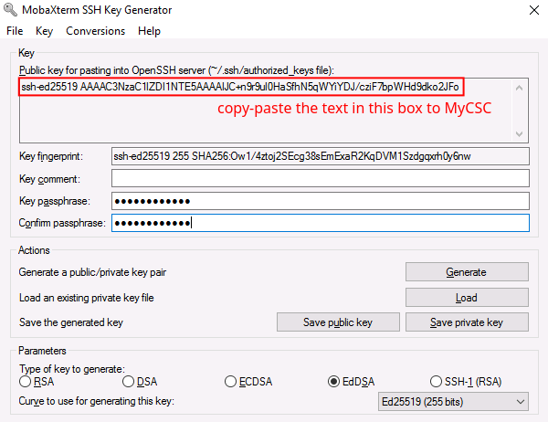

# Creating and adding SSH keys

> ‼️ To begin, make sure you have a user account at CSC that is a member of a project which has access to the Puhti service and perhaps Allas. Note that there’s a small delay before one can login to Puhti after creating a new project and adding services.
>
> 💬 SSH keys improve security and ease-of-use. They are required to be able to log in to CSC supercomputers from the terminal using an **SSH client**.
>
> ☝🏻 SSH keys are not necessary if you only use the browser-based web interfaces to log in to CSC supercomputers.

## Create SSH key pair

### Windows

💬 On Windows, there are multiple SSH clients available, such as [PuTTY](https://www.chiark.greenend.org.uk/~sgtatham/putty/latest.html) and [MobaXterm](https://mobaxterm.mobatek.net/download.html). More examples can be found in [Docs CSC](https://docs.csc.fi/computing/connecting/ssh-windows/).

‼️ MobaXterm and PuTTY provide MobaKeyGen and PuTTYgen tools for generating SSH key pairs. In this tutorial we assume you use MobaXterm and MobaKeyGen. The tools are, however, identical and the instructions can easily be adapted for PuTTYgen as well.

1. Launch MobaXterm from the applications list (opens from the Windows logo), or search for it in the bottom bar search box.
2. Open **MobaKeyGen** from the **Tools** tab.
3. In the **Parameters** section, select **Ed25519** (EdDSA) as the key type (recommended). Another acceptable alternative is RSA 4096. If you use RSA, make sure to increase the number of bits to 4096 (default is 2048).
4. Click **Generate**.

   

5. You are requested to create some randomness by moving your cursor in the blank area. Do so until the green bar is full.

   

6. Next, choose a strong **Key passphrase** for your SSH key.
   - It should be at least 8 characters long and should contain numbers, letters and special characters. **Never leave the passphrase empty!**

   

7. Finally, click **Save public key** to save your public key in a suitable location on your local workstation. Do the same for the private key by clicking **Save private key**.

   ‼️ **Never share your SSH private key with anyone!**

💭 Next, you must register your **public key** in the MyCSC portal. [Click here to continue the tutorial](#add-public-key-to-mycsc).

### Linux and macOS

1. Open a terminal on your **local Linux or macOS workstation**.
2. Create an SSH key pair in the terminal by typing:

   ```bash
   ssh-keygen -a 100 -t ed25519
   ```

   ☝🏻 We recommend the Ed25519 key type. Another acceptable alternative is RSA 4096, which can be generated by changing `-t ed25519` to `-t rsa -b 4096` in the previous `ssh-keygen` command.

3. Accept the default name and location (or customize them if needed).
4. Choose a secure passphrase for the SSH key.
   - It should be at least 8 characters long and should contain numbers, letters and special characters. **Never leave the passphrase empty!**

💭 Next, you must register your **public key** in the MyCSC portal. [Click here to continue the tutorial](#add-public-key-to-mycsc).

## Add public key to MyCSC

💬 To be able to authenticate to Puhti using SSH keys, you need to upload your **public key** to the supercomputer.

☝🏻 At CSC, SSH public keys are uploaded to the supercomputers by registering them in the MyCSC portal. **Other ways to upload SSH keys are not supported**.

1. Log in to [MyCSC](https://my.csc.fi/) with your CSC, Haka or Virtu credentials.
2. Select **Profile** from the left-hand navigation, or the dropdown menu in the top-right corner.

   

3. Locate **SSH PUBLIC KEYS** section and select **+ Add key**. As a security measure, you may be asked to log in again.

   

4. Add your public key by either:
   1. uploading the public key file in the **Upload file** tab, or
   2. manually pasting its contents into the **Key** field in the **Manual input** tab. In this case, also add a **Title** for the key, e.g. "my-ssh-key".

   ☝🏻 When generating SSH keys using MobaKeyGen, the correctly formatted public key is found in the field under *Public key for pasting into OpenSSH server* (see step 6 of the [Windows instructions](#windows)).

   

5. Select **Upload** or **Add**.
6. You should now see your new key listed under **SSH PUBLIC KEYS**.

   

‼️ Be patient, as it may take up to one hour for your new key to become active! If it takes longer than that, please contact <mailto:servicedesk@csc.fi>.

💡 Once your key has been synced, you may log in to Puhti and Mahti using an SSH client! [This is covered in the next tutorial](ssh-puhti.md).

## More information

💭 Docs CSC: More information about [connecting](https://docs.csc.fi/computing/connecting/) and [SSH keys](https://docs.csc.fi/computing/connecting/ssh-keys/).
