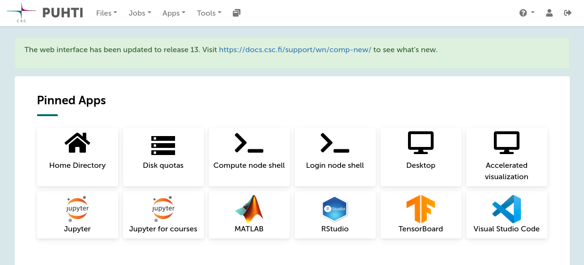
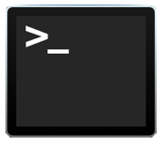
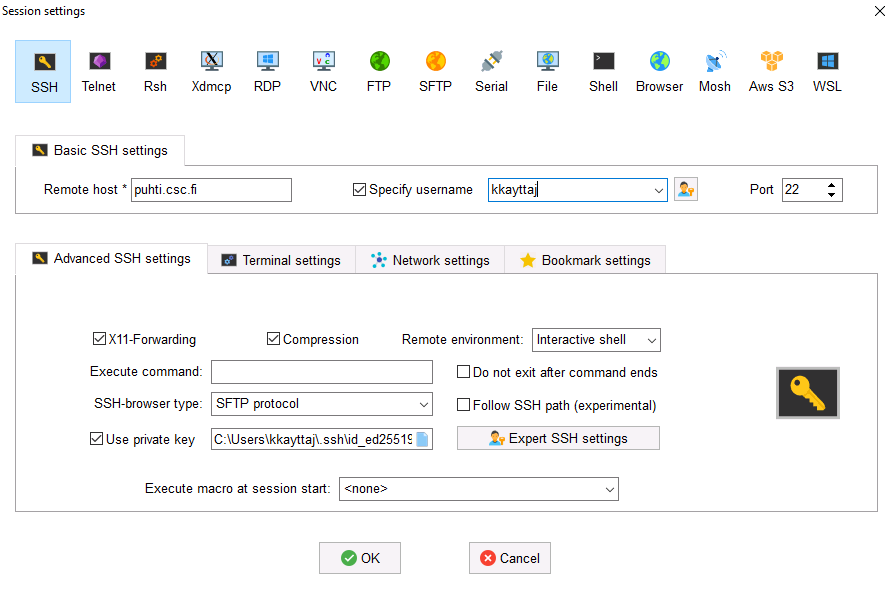
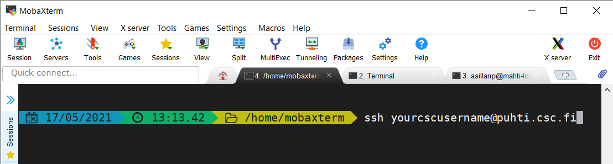

# Log in to Roihu

> ‼️ To begin make sure you have a [user account at CSC](https://docs.csc.fi/accounts/how-to-create-new-user-account/) that is a member of a project which [has access to the Roihu service](https://docs.csc.fi/accounts/how-to-add-service-access-for-project/) and perhaps [Allas](https://docs.csc.fi/data/Allas/). Note that there's a small delay before one can login to Roihu after creating a new project and adding services.
>
> ‼️ In order to [log in with SSH from the command-line](#connecting-with-ssh-from-the-command-line), you must have also set up SSH keys and uploaded your public key to MyCSC. [See the previous tutorial](ssh-keys.md).

## Roihu web interface

💬 Connecting via the Roihu web interface is an easy way to access the Roihu supercomputer.

1. Open a web browser and go to <https://www.roihu.csc.fi>
2. Login with your CSC account (or Haka/Virtu)
3. You have now connected to Roihu!

💭 The Roihu web interface landing page looks like this:  

   

💡 From the pinned apps and top menus you can, for example, access your files and open some applications or a command-line interface.

## Connecting with SSH from the command-line

💬 The basic Command-Line Interface (CLI) in Unix-based systems is the Terminal.

💡 Different operating systems have slightly different CLIs and SSH clients, i.e. programs that you can use to connect to the supercomputers.

### Connecting from Linux and macOS

💬 Laptops and workstations running Linux or macOS typically have SSH pre-installed.

Find the Terminal on your computer:



1. Open a terminal and type (replace `cscusername` with your CSC username):

   ```bash
   ssh cscusername@roihu-cpu.csc.fi
   ```

   * Note! If you have saved your SSH key with a non-default name or in a non-default location, please specify the path to your key using the `-i` option:

     ```bash
     ssh cscusername@roihu-cpu.csc.fi -i /path/to/private/key
     ```

2. You may be prompted to type your SSH key passphrase.

   💡 To avoid having to type your passphrase every time you connect to a CSC supercomputer, the `ssh-agent` utility can hold your keys in memory. Using `ssh-agent` is not necessary, but makes using SSH keys very convenient!
      * On Linux systems, `ssh-agent` is typically configured and run automatically at login and requires no additional actions on your part.
      * On macOS systems, you should add the following lines to the `~/.ssh/config` file:

        ```text
        Host *
            UseKeychain no
            AddKeysToAgent yes
        ```

3. Scroll down to [In Roihu](#in-roihu).

### Connecting from Windows

💬 On Windows you have different options:

* You can use the [Roihu web interface](https://www.roihu.csc.fi) to connect with your browser (easiest, [see above](#roihu-web-interface)).
* You can [download and install MobaXterm](https://mobaxterm.mobatek.net/download.html).
* You can [download PuTTY](https://www.chiark.greenend.org.uk/~sgtatham/putty/latest.html).
* You can use the Windows PowerShell. See [Docs CSC](https://docs.csc.fi/computing/connecting/ssh-windows/#powershell).

‼️ The following steps assume you use **MobaXterm**. [More examples can be found in Docs CSC](https://docs.csc.fi/computing/connecting/).

1. Launch MobaXterm from the applications list (opens from the Windows logo), or search for it in the bottom bar search box.
2. Click **Session** in the top-left corner and select **SSH**.
3. In the **Basic SSH settings** section, write `roihu-cpu.csc.fi` in the **Remote host** field.
4. Tick the **Specify username** box and enter your CSC username. The **Port** number can be left as 22 (default).
5. In the **Advanced SSH settings** section, tick the **Use private key** box and add the path to the SSH private key you generated in the [previous tutorial](ssh-keys.md#windows).
6. Click **OK**. If it is the first time you are connecting to Roihu, click **Accept**.

   

7. You are asked to enter your SSH key passphrase.

   💡 To avoid having to type your passphrase every time you connect, you may enable the MobAgent authentication agent in the program settings, **Settings > SSH > SSH agents**. Tick the **Use internal SSH agent "MobAgent"** box and select the key(s) you want to load.

8. You've now connected to Roihu!

   💡 The next time you want to login to Roihu, just select it from the **User session** menu on the left!

   💡 Note, you may also login with MobaXterm using the plain `ssh` command similar to Linux and macOS (see image below).

   

## In Roihu

1. If you're connecting to Roihu (or a specific Roihu login node) for the first time, SSH will ask you if you trust the authenticity of the host:

   ```text
   The authenticity of host 'roihu-cpu-login4.csc.fi' can't be established.
   ECDSA key fingerprint is SHA256:kk0Tar9opQ+6Gq0GWJdWVVvFEMeI6kW1DW1VOYveT5c.
   Are you sure you want to continue connecting (yes/no/[fingerprint])?
   ```

2. The first time you connect, you need to accept, but the key should not change for the next login.
3. Pay attention to whether you logged in to `roihu-cpu-login1`, `roihu-cpu-login2`, `roihu-cpu-login3` or `roihu-cpu-login4`.
4. Once you've logged in you'll see a greeting starting something like this:

   ```text
   ┌─ Welcome ───────────────────────────────────────────────────────────────────┐
   │         CSC - Tieteen tietotekniikan keskus - IT Center for Science         │
   │            ____        __    __  _                                          │
   │           / __ \__  __/ /_  / /_(_)   - -  -   -                            │
   │          / /_/ / / / / __ \/ __/ /   - -  -   -                             │
   │         / ____/ /_/ / / / / /_/ /   - -  -   -                              │
   │        /_/    \__,_/_/ /_/\__/_/   - -  -   -                               │
   │                                                                             │
   │      Roihu.csc.fi - Atos BullSequana X400 - 682 CPU nodes - 80 GPU nodes    │
   ├─ Contact ───────────────────────────────────────────────────────────────────┤
   │ Servicedesk : 09-457 2821, servicedesk@csc.fi   Switchboard : 09-457 2001   │
   ├─ User Guide ────────────────────────────────────────────────────────────────┤
   │ https://docs.csc.fi                                                         │
   ├─ Manage my account ─────────────────────────────────────────────────────────┤
   │ https://my.csc.fi/                                                          │
   ├─ Software ──────────────────────────────────────────────────────────────────┤
   ...
   └─────────────────────────────────────────────────────────────────────────────┘
   [cscusername@roihu-cpu-login4 ~]$
   ```

5. Now, you're ready to go!
6. Let's do our first small task in Roihu: let's check our projects and that we have a one with access to Allas service!

   ```bash
   csc-projects
   module load allas
   allas-conf
   ```

   1. The first command `csc-projects` lists your projects.
   2. The second command `module load allas` loads the Allas tools in your use.
   3. The third command `allas-conf` sets up the connection to Allas: it will ask for your CSC password, and then you need to select which project you want to use (by typing the number of the project, for example `2`).
      * If you don't see a project here, please return to [CSC account and project](credentials.md) tutorial and ensure that you have a project with access to Allas service. Please note that it can take up to an hour after accepting the terms of use before the service is in use.

## Remote graphics

💬 Remote graphics may not work by default. Try the [Roihu web interface](https://docs.csc.fi/computing/webinterface/) for running graphical applications.

💬 Another option is to enable X11-tunneling as follows.

### On Linux and macOS

1. Add X11-tunneling to your SSH connection by adding `-X` or `-Y` to your `ssh` command like this (replace `cscusername` with your CSC username):

   ```bash
   ssh -X cscusername@roihu-cpu.csc.fi
   ```

2. Note that on Mac you need to have an X server running, for example [XQuartz](https://www.xquartz.org/). You also need to set in your `.bashrc`:

   ```bash
   export DISPLAY=:0
   ```

### On Windows

1. MobaXterm will actually tunnel the connection by default!
2. PuTTY requires that an X server is installed and running. One of the options is [Xming](http://www.straightrunning.com/XmingNotes/).
3. In PuTTY, X11 forwarding is enabled in the connection settings: **Connection > SSH > X11: Enable X11 forwarding**.

☝🏻 For intensive remote graphics we recommend using the [Roihu web interface](https://www.roihu.csc.fi/).

## More information

💭 [Docs CSC: Connecting](https://docs.csc.fi/computing/connecting/)
