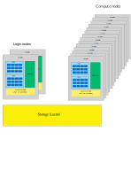

# Brief introduction to HPC environments {.title}

# Some notes on vocabulary

- computer ~= node
- processor ~= socket
- core~= CPU

# Cluster systems

- Login nodes are used to set up the jobs
- Jobs are run in the compute nodes
- A batch job system (aka scheduler) is used to run and manage the jobs
  - On CSC machines we use Slurm
  - Other common systems include SGE and Torque/PBS
  - Syntax is different, but basic operation is similar

# Planning jobs
- What kind of recources can your application use?
  - Can it use more than one core?
  - How much memory it will need?
  - Can it use GPU?
- See what kind of resources are available
  - Each system is different, so check the documentation

# Things to check
- What kind of nodes are available?
  - Number of cores
  - Size of memory
  - Extra hardware, *e.g.* GPU, fast local storage
- What partitions (queues) are available
  - Job sizes, max run time, etc
  - Provisioning policy
      - Per core/per node/other

# Available HPC resources

Check CSC Docs pages for information on available resources
  - [Puhti technical details](https://docs.csc.fi/computing/systems-puhti/)
  - [Mahti technical details](https://docs.csc.fi/computing/systems-mahti/)
  - [Available partitions](https://docs.csc.fi/computing/running/batch-job-partitions/)