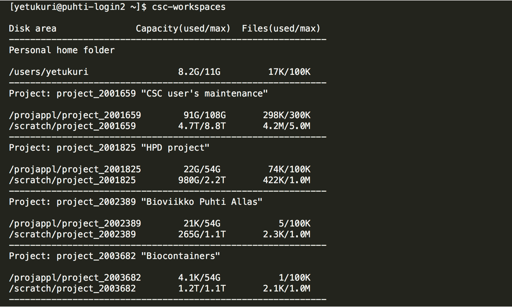

# Disk areas in CSC HPC environment {.title}
In this section, you will learn how to manage different disk areas in HPC environment at CSC

# Overview of disk areas

- Main disk areas and their specific uses in Puhti/Mahti
- Moving data between supercomputers
- Understanding quotas (both usable space and number of files) for different disk areas
- Additional fast disk areas

# Disk and storage overview  

{width=90%}

# Main disk areas in Puhti/Mahti
- Home directory (`$HOME`)
- ProjAppl directory (`/projapple/project_name`)
- Scratch directory (`/scratch/project_name`)
- These directories reside on [Lustre parallel file system](https://docs.csc.fi/computing/lustre/)
- Note that:
    - Default quotas and more info on [disk areas section](https://docs.csc.fi/computing/disk/)
    - Files older than 90 days on `scratch` will be automatically removed
    - Scratch root is shared with your computing project
    - No more `DONOTREMOVE`

# Moving data between and to/from supercomputers
- Puhti and Mahti have their own disk systems
- Data can be moved between the supercomputers 
    - [directly with rsync](https://docs.csc.fi/data/moving/rsync/) 
    - via [Allas object storage](https://docs.csc.fi/data/Allas/)
- There are [many ways to transfer data to/from CSC and your local computer](https://docs.csc.fi/data/moving/)

# Displaying current status of disk areas
- use `csc-workspaces` command to display available projects and quotas 

# Disk and storage overview (revisited) 

{width=90%}

# Additional fast local disk areas 
- `$TMPDIR` on Login nodes
    - Each of the login nodes have 2900 GiB of fast local storage `$TMPDIR`
    - The local storage is meant for temporary storage and is cleaned frequently
- NVMe on part of compute nodes in Puhti
    - Interactive batch job nodes, IO- and gpu-nodes have [local fast storage (NVMe)](https://docs.csc.fi/computing/running/creating-job-scripts-puhti/#local-storage) as `$LOCAL_SCRATCH`
    - You must copy data in and out during your batch job. NVMe is accessible only during your job allocation.
    - If your job reads or writes a lot of small files, using this can give 10x performance boost

# What are the different disk areas for?
- [Allas](https://docs.csc.fi/data/Allas/) - for data which is not actively used
- [HOME](https://docs.csc.fi/computing/disk/#home-directory) - small, thus only for most important (small) files, personal access only
- [scratch](https://docs.csc.fi/computing/disk/#scratch-directory) - main working area, can be used to share with project members
- [projappl](https://docs.csc.fi/computing/disk/#projappl-directory) - not cleaned up, e.g. for shared binaries 
- [Login node local tmp](https://docs.csc.fi/computing/disk/#login-nodes) - compiling, temporary, fast IO 
- [NVMe](https://docs.csc.fi/computing/running/creating-job-scripts-puhti/#local-storage) - fast IO in batch jobs

# Some best practice tips
- Don't put databases on Lustre (projappl, scratch, home) 
    - use other CSC services like [kaivos](https://docs.csc.fi/data/kaivos/overview/) or mongoDB in cPouta
- Don't create a lot of files in one folder
- Don't create overall a lot of files (if you're creating tens of thousands of files, you should probably rethink the workflow)
- Take backups of important files. Data on CSC disks is not backed up even if systems are fault tolerant.
- When working with the large number of smaller files, consider using fast local disks
- [Best practice performance tips for using Lustre](https://docs.csc.fi/computing/lustre/#best-practices)
