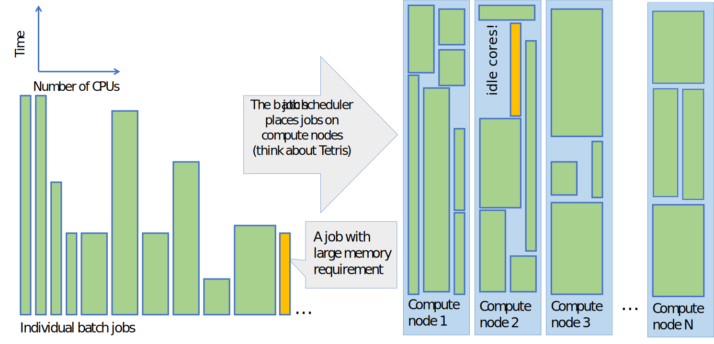

# The batch job system in CSC's HPC environment {.title}

# What is a batch job?
- On a laptop we are used to start a program(job) by clicking on an icon and the job starts instantly
- If we start many jobs at the same time we occationally run into problems like running out of memory etc. 
- In an HPC environment the computer is shared among hundreds of other users who all have different resource needs
- In order to avoid problems and make the usage as efficient as possible, all HPC jobs include an **estimate on how much resources they are expected to use**

# What is a batch job? (continued)
- A batch job consists of two parts: A resource request and the actual computing step
- A job is not started directly, but sent into a **queue**
- Depending on the resources requested by the single job, and how many other jobs there are, the job usually have to wait for some time to get started

# What is a batch job system? 
- A resource management system that keeps track of all batch jobs that uses, or would like to use the computing resources
- Aim is to share the resources in an efficient and fair way
- Optimizes resource usage by filling the compute node with most suitable jobs
- The batch system allows users to submit jobs requesting the resources (runtime, nodes, cores, memory, GPUs) that they need 
 What is a batch job system? 

# What is a batch job system? (continued)
- A job is queued and starts when the requested resources become available
- The order in which the queued jobs start depend on available resources and their priority

# Schema on how the batch job sheduler works


# The batch job system in CSC's HPC environment 
- CSC uses a batch job system [(SLURM)](https://slurm.schedmd.com/sbatch.html) to manage jobs 
- SLURM is used to control how the overall computing resources are shared among all projects in an efficient and fair way
- SLURM controls how a single job request gets resources, like:
    - computing time
    - number of cores
    - amount of memory
    - other resources like gpu, local disk, etc.
- jobs don't start instantly but are put in a queue (partition)

# Example serial batch job script for Puhti

```text
#!/bin/bash -l
#SBATCH --job-name=print_hostname
#SBATCH --time=00:01:00
#SBATCH --partition=test
#SBATCH --ntasks=1
#SBATCH --account=project_20001234

srun echo "Hello $USER! You are on node $HOSTNAME"
```
- A batch job is a shell script (bash) that consists of two parts: A resource request flagged with `#SBATCH` and the actual computing step
- The `--account` option is mandatory to tell which project should be billed.
- The actual program is launched using the `srun` command
- The content above could be copied into a file like `simple_serial.bash` and put into the queue with the command `sbatch simple_serial.bash`
 
# Available batch job partitions

- [The available batch job partitions](https://docs.csc.fi/computing/running/batch-job-partitions/)
- in order use the resources in an efficient way, it is important to estimate the request as accurately as possible
- by avoiding an excessive "just-in-case" request, the job will start earlier 
- consult our [Getting started with the batch job system ](https://docs.csc.fi/computing/running/getting-started/)

# Different type of HPC jobs

- typically an HPC job can be classified as serial, parallel or gpu, depending on the main requested resource 
- each batch job is billed using a scheme that takes into account the requested resources
- Note that the billing is based on the actual time a job has used, not the reserved maximum time 
- see the [Billing unit (BU) and price calculator at research.csc.fi](https://research.csc.fi/billing-and-monitoring#buc)
- the billing is done per project

# Different type of HPC jobs (continued)
- via the [My Projects page in MyCSC](https://my.csc.fi/welcome) you can monitor the BU consumption and apply for more billing units
- "csc-projects" is a command line tool for showing the BU consumption per project    

# Mapping your needs and the performance

- Before starting any large-scale calculations it's a good practice to check how the software and your actual input performs
    - use short runs in the queue `--partition=test` to check that the input works and that the resource requests are interpreted correctly
    - if the program works in parallel check that it benefits from the requested parallel resources 
    - check the output from the `seff` command to ensure that the cpu and memory performances are sufficient 

# HPC serial jobs 

- a serial software can only use one core, so don't reserve more!
- why could your serial job benefit from being executed using CSC's resources instead of on your own computer? 

    - part of a larger workflow
    - avoid data transfer between CSC and your own computer
    - data sharing among other project members
    - CSC's software licensing
    - memory and/or disk demands

# HPC serial jobs (continued)
- You can utilize parallel resources for running multiple serial jobs at the same time
    - [Array jobs](https://docs.csc.fi/computing/running/array-jobs/) 
    - [GREASY jobs](https://docs.csc.fi/computing/running/greasy/)
- pure serial resources are only available in Puhti, but **GREASY jobs** can use Mahti, as well
 
# HPC parallel jobs

- A parallel job distributes the calculation over several cores in order to achieve a shorter wall time (and/or a larger allocatable memory)   
- There are two major parallelization schemes: [OpenMP](https://en.wikipedia.org/wiki/OpenMP) and [MPI](https://en.wikipedia.org/wiki/Message_Passing_Interface)
- depending on the parallellization scheme there is a slight difference between how the resource reservation is done  
- [examples of batch job skripts on Puhti](https://docs.csc.fi/computing/running/creating-job-scripts-puhti/)
- [examples of batch job skripts on Mahti](https://docs.csc.fi/computing/running/example-job-scripts-mahti/)


# HPC gpu jobs 

- A graphics processing unit (GPU, a video card), is capable of doing certain type of simlutaneous calculations very efficiently
- In order to take advantage of this power, a computer program has to be reprogrammed to be adapt to how GPU's handles data   
- CSC's gpu resources are relatively scarce and hence should be used with [particular care](https://docs.csc.fi/computing/overview/#gpu-nodes)


# Interactive jobs

- when you login to CSC's supercomputers, you end up in one of the login nodes of the computer. These login nodes are shared by all users and they are not intended for heavy computing. 
- if you have a heavier job that still requires interactive response (e.g. graphical user interface )
    - allocate the resource via the the [interactive partition](https://docs.csc.fi/computing/running/interactive-usage/)

# Submitting, cancelling and stats of batch jobs
- The job script file is submitted with the command
   - `sbatch batch_job.bash`
- List all your jobs that are queuing/running
   - `squeue -u $HOME`
- Detailed info of a queuing/running job:
   - `scontrol show job <jobid>`
- A job can be deleted using the command:
   - `scancel <jobid>`
- Display the used resources of a completed job:
   - `seff <jobid>`

# Reserving and optimizing batch job resources 

The computing resources are shared among hundreds of your colleagues, who all have different resource needs.
Try to estimate the resources that are needed for your job as accurately as possible, in order to minimize the **waste** 

- Important resource requests that should be monitored are:
   - [Scaling of a job over several cores and nodes](https://docs.csc.fi/computing/running/performance-checklist/#perform-a-scaling-test)
   - [Memory requirement](https://docs.csc.fi/support/faq/how-much-memory-my-job-needs/)  
   - [Disk workload](https://docs.csc.fi/computing/running/creating-job-scripts-puhti/#local-storage)
   - [GPU efficiency](https://docs.csc.fi/computing/overview/#gpu-nodes)
 

  

