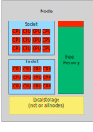
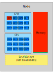
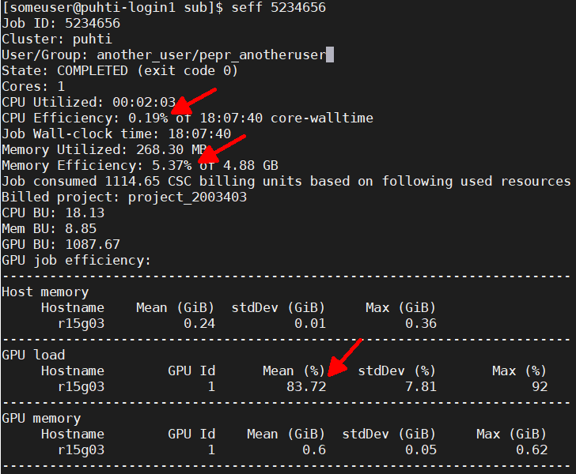

# Understanding resource usage in CSC's HPC environment {.title}

<small>
All material (C) 2020-2021 by CSC -IT Center for Science Ltd.
This work is licensed under a **Creative Commons Attribution-NonCommercial-ShareAlike** 4.0
Unported License, [http://creativecommons.org/licenses/by-nc-sa/4.0/](http://creativecommons.org/licenses/by-nc-sa/4.0/)
</small>

# Optimal usage in multiuser platforms

- Resources that have been allocated to your job, are not available for others
   - Request only resources you need
   - Make sure you used the resources that were requested
- If you _can_ use more resources, should you?
   - There are multiple ways of parallelizing your workflow
      - Maybe several smaller jobs are better than one big?
      - Is there a more efficient code or algorithm?
      - Is the file I/O slowing you down? (lots of file operations)
   - Optimize usage considering single job wall time, overall used cpu time
- This section helps you find out how much resources your job needs

# One resource type will be a bottle neck

- One node can host many jobs from different users
- Different jobs need different resources
- Typically the cores run out first, but there's memory left
- Sometimes one job uses only one core, but will take up all memory
   - No further jobs are possible
   - If the job is *not* using the memory, resources are wasted

{width=45%}
{width=45%}

# Slurm accounting: batch job resource usage 1/2

- Resource usage can be queried with `seff SLURM_JOBID`
- Things to note:
   - low CPU Efficiency:
      - Too many cores selected?
      - Cores waiting for other processes?
      - Cores waiting for data from disk?
      - Cores spread on too many nodes? 
   - low Memory Efficiency:
      - Too much memory requested?
      - Lots of caveats here
   - low GPU efficiency:
      - Better use CPU instead? Disk I/O?

{width=90%}

# Slurm accounting: batch job resource usage 2/2

- Not all usage is captured by Slurm accounting
   - If CPU usage seems too low, look at the completion time
   - Some applications also print out timing data on log files
   - Sometimes jobs run outside `srun` don't record properly
- Job output can be tailored with `sacct`
   - `sacct -j SLURM_JOBID -o jobid,partition,state,elapsed,start,end`
   - `sacct -S 2021-08-01` would show all jobs started after that date
   - Note: these are heavy operations for Slurm. **Don't** query
     too long times, or loop these commands in scripts

# Billing units - also a currency to compare usage efficiency

- CPU time and storing files consume "Billing units" (BU)
- BUs are a property of computing projects and can be applied via [my.csc.fi](https://my.csc.fi)
   - Please acknowledge using CSC resources in your publications and add them to the resource application!
   - Academic usage is one of the [free-of-use cases](https://research.csc.fi/pricing)
- You can estimate [usage with the online billing calculator](https://research.csc.fi/pricing) 
   - The calculator can also be used to estimate the value of the resources

# Billing units - also a currency to compare usage efficiency

- Different resources have different rates
   - 1 CPU core hour in Puhti equals 1 BU
   - 1 GPU card hour in Puhti equals 60 BU (+ allocated CPU cores)
   - 1 node hour in Mahti equals 100 BU
   - 1 GiB hour of Memory in Puhti equals 0.1 BU
   - 1 TiB year of _additional_ disk in Puhti (scratch, projappl) 50000 BU
      - Note: 1st TiB free, additional **quota** (not actual usage) is billed.
   - 1 TiB hour in Allas equals 1 BU (i.e. 1 TiB of data equals 8760 BU in a year.)
      - Note: Billing is based on actual usage.
   - [This and other service billing information in Docs](https://docs.csc.fi/accounts/billing/)

# Mapping your needs and the performance

- Before starting any large-scale calculations it's a good practice to check how the software and your actual input performs
    - Use short runs in the queue `--partition=test` to check that the input works and that the resource requests are interpreted correctly
    - If the program works in parallel, check that it benefits from the requested parallel resources 
    - The recommended _minimum_ speedup when you double the resources is 1.5x faster
    - Check the output from the `seff` command to ensure that the cpu and memory performances are sufficient 

# Reserving and optimizing batch job resources 

The computing resources are shared among hundreds of your colleagues, who all have different resource needs.
Try to estimate the resources that are needed for your job as accurately as possible, in order to minimize the **waste** 

- Important resource requests that should be monitored are:
   - [Scaling of a job over several cores and nodes](https://docs.csc.fi/computing/running/performance-checklist/#perform-a-scaling-test)
   - [Memory requirement](https://docs.csc.fi/support/faq/how-much-memory-my-job-needs/)  
   - [Disk workload](https://docs.csc.fi/computing/running/creating-job-scripts-puhti/#local-storage)
   - [GPU efficiency](https://docs.csc.fi/computing/overview/#gpu-nodes)
 
# `seff` examples

{width=90%}

<small>
Left: GPU usage ok! (for _this_ others ok, too)

Bottom: CPU usage way too low, memory usage too high, job killed.
</small>
{width=90%}

  

